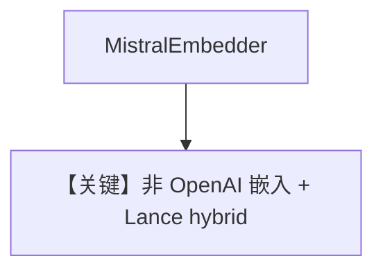

# lance_db_with_mistral_embedder.py — 实现原理分析

<!-- cookbook-py-source:start -->
## 完整源码

```python
"""
LanceDB With Mistral Embedder
=============================

Demonstrates LanceDB hybrid search with the Mistral embedder.
"""

import asyncio

from agno.knowledge.embedder.mistral import MistralEmbedder
from agno.knowledge.knowledge import Knowledge
from agno.knowledge.reader.pdf_reader import PDFReader
from agno.vectordb.lancedb import LanceDb, SearchType

# ---------------------------------------------------------------------------
# Setup
# ---------------------------------------------------------------------------
embedder_mi = MistralEmbedder()
reader = PDFReader(chunk_size=1024)

vector_db = LanceDb(
    uri="tmp/lancedb",
    table_name="documents",
    embedder=embedder_mi,
    search_type=SearchType.hybrid,
)


# ---------------------------------------------------------------------------
# Create Knowledge Base
# ---------------------------------------------------------------------------
knowledge = Knowledge(
    name="My Document Knowledge Base",
    vector_db=vector_db,
)


# ---------------------------------------------------------------------------
# Run Agent
# ---------------------------------------------------------------------------
async def main() -> None:
    await knowledge.ainsert(
        name="CV",
        path="cookbook/07_knowledge/testing_resources/cv_1.pdf",
        metadata={"user_tag": "Engineering Candidates"},
        reader=reader,
    )


if __name__ == "__main__":
    asyncio.run(main())
```

<!-- cookbook-py-source:end -->

> 源文件：`cookbook/07_knowledge/09_archive/vector_dbs/lance_db_with_mistral_embedder.py`

## 概述

**`MistralEmbedder`** + **`PDFReader(chunk_size=1024)`** + **`SearchType.hybrid`**；仅 **`ainsert`**，**无 Agent 调用**（脚本止于入库）。

**核心配置一览：**

| 配置项 | 值 | 说明 |
|--------|-----|------|
| `embedder` | Mistral | 与 OpenAI 嵌入对照 |

## 核心组件解析

异构嵌入模型需与维度、索引配置一致；本例突出 **Mistral 嵌入管线**。

## System Prompt 组装

无 Agent，无 `get_system_message`。

## 完整 API 请求

Mistral Embeddings API；无聊天。

## Mermaid 流程图



## 关键源码文件索引

| 文件 | 作用 |
|------|------|
| `agno/knowledge/embedder/mistral.py` | |
