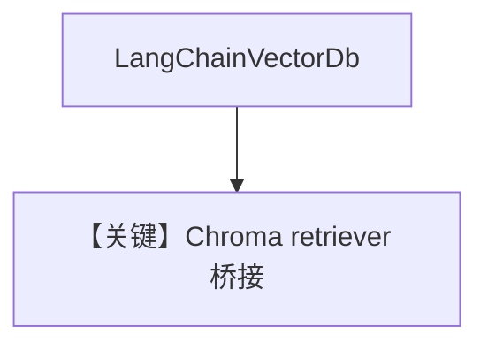

# langchain_db.py — 实现原理分析

<!-- cookbook-py-source:start -->
## 完整源码

```python
"""
LangChain Vector DB
===================

Install dependencies:
- uv pip install langchain langchain-community langchain-openai langchain-chroma agno
"""

import asyncio
import pathlib

from agno.agent import Agent
from agno.knowledge.knowledge import Knowledge
from agno.models.openai import OpenAIChat
from agno.vectordb.langchaindb import LangChainVectorDb
from langchain.text_splitter import CharacterTextSplitter
from langchain_chroma import Chroma
from langchain_community.document_loaders import TextLoader
from langchain_openai import OpenAIEmbeddings

# ---------------------------------------------------------------------------
# Setup
# ---------------------------------------------------------------------------
chroma_db_dir = pathlib.Path("./chroma_db")
state_of_the_union = pathlib.Path(
    "cookbook/07_knowledge/testing_resources/state_of_the_union.txt"
)


# ---------------------------------------------------------------------------
# Create Knowledge Base
# ---------------------------------------------------------------------------
def create_documents():
    raw_documents = TextLoader(str(state_of_the_union), encoding="utf-8").load()
    text_splitter = CharacterTextSplitter(chunk_size=1000, chunk_overlap=0)
    return text_splitter.split_documents(raw_documents)


def create_knowledge() -> Knowledge:
    db = Chroma(
        embedding_function=OpenAIEmbeddings(),
        persist_directory=str(chroma_db_dir),
    )
    knowledge_retriever = db.as_retriever()
    return Knowledge(
        vector_db=LangChainVectorDb(knowledge_retriever=knowledge_retriever)
    )


# ---------------------------------------------------------------------------
# Create Agent
# ---------------------------------------------------------------------------
def create_agent(knowledge: Knowledge) -> Agent:
    return Agent(model=OpenAIChat("gpt-5.2"), knowledge=knowledge)


# ---------------------------------------------------------------------------
# Run Agent
# ---------------------------------------------------------------------------
def run_sync() -> None:
    documents = create_documents()
    Chroma.from_documents(
        documents,
        OpenAIEmbeddings(),
        persist_directory=str(chroma_db_dir),
    )

    knowledge = create_knowledge()
    agent = create_agent(knowledge)
    agent.print_response(
        "What did the president say about broadcasting and the State of the Union?",
        markdown=True,
    )


async def run_async() -> None:
    documents = create_documents()
    await asyncio.get_event_loop().run_in_executor(
        None,
        lambda: Chroma.from_documents(
            documents,
            OpenAIEmbeddings(),
            persist_directory=str(chroma_db_dir),
        ),
    )

    knowledge = create_knowledge()
    agent = create_agent(knowledge)
    await agent.aprint_response(
        "What did the president say about broadcasting and the State of the Union?",
        markdown=True,
    )


if __name__ == "__main__":
    run_sync()
    asyncio.run(run_async())
```

<!-- cookbook-py-source:end -->

> 源文件：`cookbook/07_knowledge/09_archive/vector_dbs/langchain_db.py`

## 概述

**`LangChainVectorDb`**：用 **LangChain `Chroma` + `OpenAIEmbeddings` + `as_retriever()`** 包装为 Agno `Knowledge` 的 `vector_db`；**`Agent(model=OpenAIChat("gpt-5.2"))`**。

**核心配置一览：**

| 配置项 | 值 | 说明 |
|--------|-----|------|
| 数据 | `state_of_the_union.txt` / Chroma persist | |

## 核心组件解析

桥接 **LlamaIndex/LangChain 生态** 与 Agno Agent；检索仍走 `search_knowledge_base` 适配层。

## System Prompt 组装

默认 knowledge 段。

## 完整 API 请求

`gpt-5.2` + LangChain OpenAI Embeddings。

## Mermaid 流程图



## 关键源码文件索引

| 文件 | 作用 |
|------|------|
| `agno/vectordb/langchaindb/` | |
