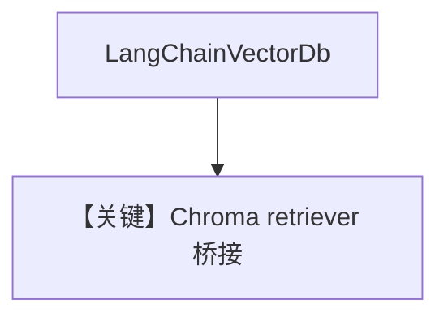

# langchain_db.py — 实现原理分析

> 源文件：`cookbook/07_knowledge/09_archive/vector_dbs/langchain_db.py`

## 概述

**`LangChainVectorDb`**：用 **LangChain `Chroma` + `OpenAIEmbeddings` + `as_retriever()`** 包装为 Agno `Knowledge` 的 `vector_db`；**`Agent(model=OpenAIChat("gpt-5.2"))`**。

**核心配置一览：**

| 配置项 | 值 | 说明 |
|--------|-----|------|
| 数据 | `state_of_the_union.txt` / Chroma persist | |

## 核心组件解析

桥接 **LlamaIndex/LangChain 生态** 与 Agno Agent；检索仍走 `search_knowledge_base` 适配层。

## System Prompt 组装

默认 knowledge 段。

## 完整 API 请求

`gpt-5.2` + LangChain OpenAI Embeddings。

## Mermaid 流程图

## 关键源码文件索引

| 文件 | 作用 |
|------|------|
| `agno/vectordb/langchaindb/` | |
