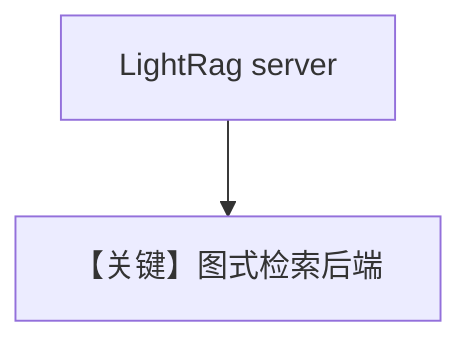

# lightrag.py — 实现原理分析

<!-- cookbook-py-source:start -->
## 完整源码

```python
"""
LightRAG Vector DB
==================

Demonstrates LightRAG-backed knowledge and retrieval with references.
"""

import asyncio
import time
from os import getenv

from agno.agent import Agent
from agno.knowledge.knowledge import Knowledge
from agno.knowledge.reader.wikipedia_reader import WikipediaReader
from agno.vectordb.lightrag import LightRag

# ---------------------------------------------------------------------------
# Setup
# ---------------------------------------------------------------------------
vector_db = LightRag(
    server_url=getenv("LIGHTRAG_SERVER_URL", "http://localhost:9621"),
    api_key=getenv("LIGHTRAG_API_KEY"),
)


# ---------------------------------------------------------------------------
# Create Knowledge Base
# ---------------------------------------------------------------------------
knowledge = Knowledge(
    name="LightRAG Knowledge Base",
    description="Knowledge base using LightRAG for graph-based retrieval",
    vector_db=vector_db,
)


# ---------------------------------------------------------------------------
# Create Agent
# ---------------------------------------------------------------------------
agent = Agent(
    knowledge=knowledge,
    search_knowledge=True,
    read_chat_history=False,
)


# ---------------------------------------------------------------------------
# Run Agent
# ---------------------------------------------------------------------------
async def main() -> None:
    await knowledge.ainsert(
        name="Recipes",
        path="cookbook/07_knowledge/testing_resources/cv_1.pdf",
        metadata={"doc_type": "recipe_book"},
    )
    await knowledge.ainsert(
        name="Recipes",
        topics=["Manchester United"],
        reader=WikipediaReader(),
    )
    await knowledge.ainsert(
        name="Recipes",
        path="cookbook/07_knowledge/testing_resources/cv_2.pdf",
    )

    time.sleep(60)

    await agent.aprint_response("What skills does Jordan Mitchell have?", markdown=True)
    await agent.aprint_response(
        "In what year did Manchester United change their name?",
        markdown=True,
    )

    results = await vector_db.async_search("What skills does Jordan Mitchell have?")
    if results:
        doc = results[0]
        print(f"References: {doc.meta_data.get('references', [])}")


if __name__ == "__main__":
    asyncio.run(main())
```

<!-- cookbook-py-source:end -->

> 源文件：`cookbook/07_knowledge/09_archive/vector_dbs/lightrag.py`

## 概述

**`LightRag`**：连接 **`LIGHTRAG_SERVER_URL`**（默认 `http://localhost:9621`）与可选 **`LIGHTRAG_API_KEY`**；**`WikipediaReader`** 与 PDF **`ainsert`**；**`read_chat_history=False`**。

**核心配置一览：**

| 配置项 | 值 | 说明 |
|--------|-----|------|
| `vector_db` | `LightRag(server_url=..., api_key=...)` | 远程图/向量服务 |

## 核心组件解析

LightRAG 侧重图增强检索；需独立服务进程。

## System Prompt 组装

默认 knowledge 段。

## 完整 API 请求

默认 `gpt-4o` + LightRAG HTTP。

## Mermaid 流程图



## 关键源码文件索引

| 文件 | 作用 |
|------|------|
| `agno/vectordb/lightrag/` | |
