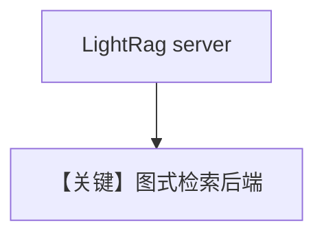

# lightrag.py — 实现原理分析

> 源文件：`cookbook/07_knowledge/09_archive/vector_dbs/lightrag.py`

## 概述

**`LightRag`**：连接 **`LIGHTRAG_SERVER_URL`**（默认 `http://localhost:9621`）与可选 **`LIGHTRAG_API_KEY`**；**`WikipediaReader`** 与 PDF **`ainsert`**；**`read_chat_history=False`**。

**核心配置一览：**

| 配置项 | 值 | 说明 |
|--------|-----|------|
| `vector_db` | `LightRag(server_url=..., api_key=...)` | 远程图/向量服务 |

## 核心组件解析

LightRAG 侧重图增强检索；需独立服务进程。

## System Prompt 组装

默认 knowledge 段。

## 完整 API 请求

默认 `gpt-4o` + LightRAG HTTP。

## Mermaid 流程图

## 关键源码文件索引

| 文件 | 作用 |
|------|------|
| `agno/vectordb/lightrag/` | |
