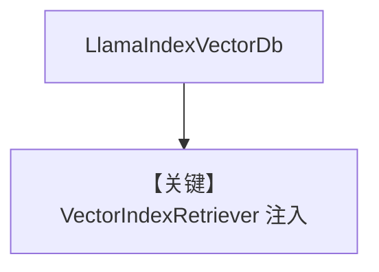

# llamaindex_db.py — 实现原理分析

> 源文件：`cookbook/07_knowledge/09_archive/vector_dbs/llamaindex_db.py`

## 概述

**`LlamaIndexVectorDb`**：**`SimpleDirectoryReader` → `SentenceSplitter` → `VectorStoreIndex` → `VectorIndexRetriever`**，再交给 Agno；数据为 **Paul Graham essay** 下载到 `wip/data/...`。

**核心配置一览：**

| 配置项 | 值 | 说明 |
|--------|-----|------|
| `OpenAIChat` | 见 `create_agent` | |

## 核心组件解析

完全在 LlamaIndex 侧建索引，Agno 只消费 **retriever** 接口。

## System Prompt 组装

默认 knowledge 段。

## 完整 API 请求

OpenAI Chat + LlamaIndex OpenAI Embeddings。

## Mermaid 流程图

## 关键源码文件索引

| 文件 | 作用 |
|------|------|
| `agno/vectordb/llamaindex/` | |
