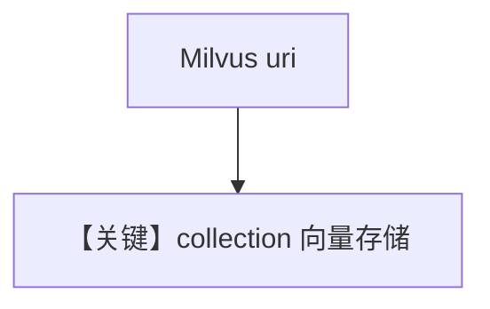

# milvus_db.py — 实现原理分析

> 源文件：`cookbook/07_knowledge/09_archive/vector_dbs/milvus_db.py`

## 概述

**`Milvus`**：**`/tmp/milvus.db` Lite** 或 **`http://localhost:19530`**；**`OpenAIChat`** 异步 Agent；batch 路径 **`OpenAIEmbedder(enable_batch=True)`**。

**核心配置一览：**

| 配置项 | 值 | 说明 |
|--------|-----|------|
| `collection` / `uri` | 多集合名 | 本地文件 vs 服务 |

## 核心组件解析

Milvus 适合十亿级向量；Lite 便于本机无 Docker。

## System Prompt 组装

默认 knowledge 段。

## 完整 API 请求

`OpenAIChat` + Embeddings。

## Mermaid 流程图

## 关键源码文件索引

| 文件 | 作用 |
|------|------|
| `agno/vectordb/milvus/` | |
