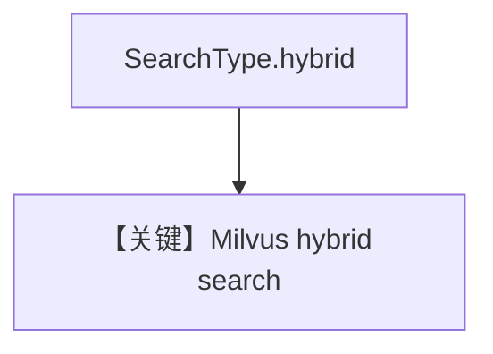

# milvus_db_hybrid_search.py — 实现原理分析

> 源文件：`cookbook/07_knowledge/09_archive/vector_dbs/milvus_db_hybrid_search.py`

## 概述

**`Milvus`** + **`SearchType.hybrid`**；同步/异步各执行一次 **`insert` 食谱 + 问 Tom Kha Gai**。

**核心配置一览：**

| 配置项 | 值 | 说明 |
|--------|-----|------|
| `uri` | `/tmp/milvus_hybrid.db` | |

## 核心组件解析

Milvus 混合检索融合稠密与稀疏通道（实现见适配器）。

## System Prompt 组装

默认 knowledge 段。

## 完整 API 请求

默认 `gpt-4o`。

## Mermaid 流程图

## 关键源码文件索引

| 文件 | 作用 |
|------|------|
| `agno/vectordb/milvus/` | `SearchType` |
