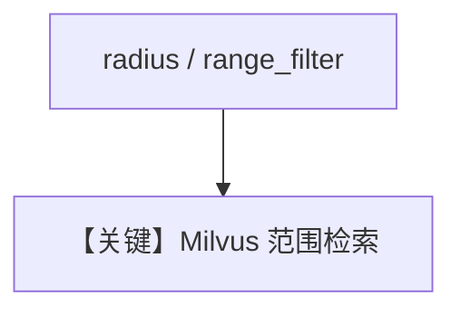

# milvus_db_range_search.py — 实现原理分析

<!-- cookbook-py-source:start -->
## 完整源码

```python
"""
Milvus Range Search
===================

Demonstrates Milvus range-search parameters (`radius`, `range_filter`) in sync and async calls.
"""

import asyncio

from agno.agent import Agent
from agno.knowledge.knowledge import Knowledge
from agno.vectordb.milvus import Milvus

# ---------------------------------------------------------------------------
# Setup
# ---------------------------------------------------------------------------
vector_db = Milvus(
    collection="recipes_range_search",
    uri="/tmp/milvus_range.db",
)


# ---------------------------------------------------------------------------
# Create Knowledge Base
# ---------------------------------------------------------------------------
knowledge = Knowledge(
    name="My Milvus Range Search Knowledge Base",
    description="This demonstrates range-based search with radius and range_filter parameters",
    vector_db=vector_db,
)


# ---------------------------------------------------------------------------
# Create Agent
# ---------------------------------------------------------------------------
agent = Agent(knowledge=knowledge)


# ---------------------------------------------------------------------------
# Run Agent
# ---------------------------------------------------------------------------
async def main() -> None:
    knowledge.insert(
        name="Recipes",
        url="https://agno-public.s3.amazonaws.com/recipes/ThaiRecipes.pdf",
        metadata={"doc_type": "recipe_book"},
    )

    print("=" * 80)
    print("Example 1: Regular search (no radius/range_filter)")
    print("=" * 80)
    agent.print_response("How to make Tom Kha Gai", markdown=True)

    print("\n" + "=" * 80)
    print("Example 2: Search with radius parameter (minimum similarity threshold)")
    print("=" * 80)
    query = "How to make Thai curry"
    results = knowledge.vector_db.search(
        query=query,
        limit=5,
        search_params={"radius": 0.3},
    )
    print(f"\nFound {len(results)} documents with similarity >= 0.3:")
    for i, doc in enumerate(results, 1):
        print(f"\n{i}. {doc.name}")
        print(f"   Content preview: {doc.content[:100]}...")

    print("\n" + "=" * 80)
    print("Example 3: Search with radius and range_filter (similarity range)")
    print("=" * 80)
    results_with_range = knowledge.vector_db.search(
        query=query,
        limit=5,
        search_params={"radius": 0.3, "range_filter": 0.8},
    )
    print(
        f"\nFound {len(results_with_range)} documents with similarity in range [0.3, 0.8]:"
    )
    for i, doc in enumerate(results_with_range, 1):
        print(f"\n{i}. {doc.name}")
        print(f"   Content preview: {doc.content[:100]}...")

    print("\n" + "=" * 80)
    print("Example 4: Async search with range parameters")
    print("=" * 80)
    async_results = await knowledge.vector_db.async_search(
        query="Thai desserts",
        limit=3,
        search_params={"radius": 0.3, "range_filter": 0.9},
    )
    print(f"\nAsync search found {len(async_results)} documents:")
    for i, doc in enumerate(async_results, 1):
        print(f"\n{i}. {doc.name}")
        print(f"   Content preview: {doc.content[:100]}...")

    print("\n" + "=" * 80)
    print("Cleaning up...")
    print("=" * 80)
    vector_db.delete_by_metadata({"doc_type": "recipe_book"})
    print("Cleaned up successfully!")


if __name__ == "__main__":
    asyncio.run(main())
```

<!-- cookbook-py-source:end -->

> 源文件：`cookbook/07_knowledge/09_archive/vector_dbs/milvus_db_range_search.py`

## 概述

**`Milvus`** **`/tmp/milvus_range.db`**：演示 **普通 search** 与带 **`radius` / `range_filter`** 的 **范围搜索**（最小相似度等）；`insert` 食谱 PDF。

**核心配置一览：**

| 配置项 | 值 | 说明 |
|--------|-----|------|
| 范围参数 | `radius`, `range_filter` | 见源码 print 段 |

## 核心组件解析

范围搜索用于过滤低相关近邻，减少噪声块。

## System Prompt 组装

默认 knowledge 段。

## 完整 API 请求

默认 `gpt-4o`。

## Mermaid 流程图



## 关键源码文件索引

| 文件 | 作用 |
|------|------|
| `agno/vectordb/milvus/` | search 参数 |
