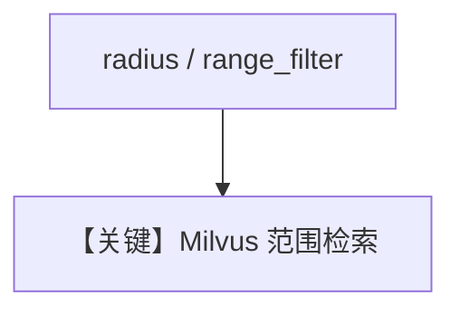

# milvus_db_range_search.py — 实现原理分析

> 源文件：`cookbook/07_knowledge/09_archive/vector_dbs/milvus_db_range_search.py`

## 概述

**`Milvus`** **`/tmp/milvus_range.db`**：演示 **普通 search** 与带 **`radius` / `range_filter`** 的 **范围搜索**（最小相似度等）；`insert` 食谱 PDF。

**核心配置一览：**

| 配置项 | 值 | 说明 |
|--------|-----|------|
| 范围参数 | `radius`, `range_filter` | 见源码 print 段 |

## 核心组件解析

范围搜索用于过滤低相关近邻，减少噪声块。

## System Prompt 组装

默认 knowledge 段。

## 完整 API 请求

默认 `gpt-4o`。

## Mermaid 流程图

## 关键源码文件索引

| 文件 | 作用 |
|------|------|
| `agno/vectordb/milvus/` | search 参数 |
