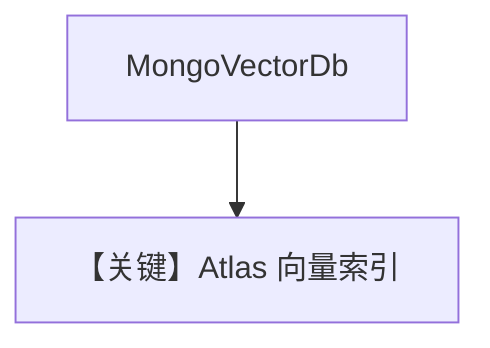

# mongo_db.py — 实现原理分析

> 源文件：`cookbook/07_knowledge/09_archive/vector_dbs/mongo_db.py`

## 概述

**`MongoVectorDb`**：Atlas 或 **Docker `mongodb-atlas-local`**；长文档说明建集群与连接串；**`OpenAIChat`** + batch **`OpenAIEmbedder`**。

**核心配置一览：**

| 配置项 | 值 | 说明 |
|--------|-----|------|
| `mdb_connection_string` | 占位 `mongodb+srv://...` | |

## 核心组件解析

MongoDB Atlas Vector Search 需预先创建向量索引名（`search_index_name`）。

## System Prompt 组装

默认 knowledge 段。

## 完整 API 请求

OpenAI Chat + Embeddings。

## Mermaid 流程图

## 关键源码文件索引

| 文件 | 作用 |
|------|------|
| `agno/vectordb/mongodb/` | |
