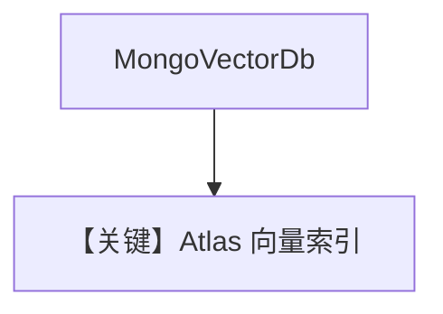

# mongo_db.py — 实现原理分析

<!-- cookbook-py-source:start -->
## 完整源码

```python
"""
MongoDB Vector DB
=================

1. Create a MongoDB Atlas Account:
   - Go to https://www.mongodb.com/cloud/atlas/register
   - Sign up for a free account

2. Create a New Cluster:
   - Click "Build a Database"
   - Choose the FREE tier (M0)
   - Select your preferred cloud provider and region
   - Click "Create Cluster"

3. Set Up Database Access:
   - Follow the instructions in the MongoDB Atlas UI
   - Create a username and password
   - Click "Add New Database User"

5. Get Connection String:
   - Select "Drivers" as connection method
   - Select "Python" as driver
   - Copy the connection string

7. Test Connection:
   - Use the connection string in your code
   - Ensure pymongo is installed: uv pip install "pymongo[srv]"
   - Test with a simple query to verify connectivity

Alternatively to test locally, you can run a docker container

docker run -p 27017:27017 -d --name mongodb-container --rm -v ./tmp/mongo-data:/data/db mongodb/mongodb-atlas-local:8.0.3
"""

import asyncio

from agno.agent import Agent
from agno.knowledge.embedder.openai import OpenAIEmbedder
from agno.knowledge.knowledge import Knowledge
from agno.models.openai import OpenAIChat
from agno.vectordb.mongodb import MongoVectorDb

# ---------------------------------------------------------------------------
# Setup
# ---------------------------------------------------------------------------
mdb_connection_string = "mongodb+srv://<username>:<password>@cluster0.mongodb.net/?retryWrites=true&w=majority"


# ---------------------------------------------------------------------------
# Create Knowledge Base
# ---------------------------------------------------------------------------
def create_sync_knowledge() -> Knowledge:
    return Knowledge(
        vector_db=MongoVectorDb(
            collection_name="recipes",
            db_url=mdb_connection_string,
            search_index_name="recipes",
        )
    )


def create_async_knowledge(enable_batch: bool = False) -> Knowledge:
    if enable_batch:
        return Knowledge(
            vector_db=MongoVectorDb(
                collection_name="documents",
                db_url=mdb_connection_string,
                database="agno",
                embedder=OpenAIEmbedder(enable_batch=True),
            )
        )
    return Knowledge(
        vector_db=MongoVectorDb(
            collection_name="recipes",
            db_url=mdb_connection_string,
        )
    )


# ---------------------------------------------------------------------------
# Create Agent
# ---------------------------------------------------------------------------
def create_sync_agent(knowledge: Knowledge) -> Agent:
    return Agent(knowledge=knowledge)


def create_async_agent(knowledge: Knowledge, enable_batch: bool = False) -> Agent:
    if enable_batch:
        return Agent(
            model=OpenAIChat(id="gpt-5.2"),
            knowledge=knowledge,
            search_knowledge=True,
            read_chat_history=True,
        )
    return Agent(knowledge=knowledge)


# ---------------------------------------------------------------------------
# Run Agent
# ---------------------------------------------------------------------------
def run_sync() -> None:
    knowledge = create_sync_knowledge()
    knowledge.insert(
        name="Recipes",
        url="https://agno-public.s3.amazonaws.com/recipes/ThaiRecipes.pdf",
        metadata={"doc_type": "recipe_book"},
    )

    agent = create_sync_agent(knowledge)
    agent.print_response("How to make Thai curry?", markdown=True)


async def run_async(enable_batch: bool = False) -> None:
    knowledge = create_async_knowledge(enable_batch=enable_batch)
    agent = create_async_agent(knowledge, enable_batch=enable_batch)

    if enable_batch:
        await knowledge.ainsert(path="cookbook/07_knowledge/testing_resources/cv_1.pdf")
        await agent.aprint_response(
            "What can you tell me about the candidate and what are his skills?",
            markdown=True,
        )
    else:
        await knowledge.ainsert(
            url="https://agno-public.s3.amazonaws.com/recipes/ThaiRecipes.pdf"
        )
        await agent.aprint_response("How to make Thai curry?", markdown=True)


if __name__ == "__main__":
    run_sync()
    asyncio.run(run_async(enable_batch=False))
    asyncio.run(run_async(enable_batch=True))
```

<!-- cookbook-py-source:end -->

> 源文件：`cookbook/07_knowledge/09_archive/vector_dbs/mongo_db.py`

## 概述

**`MongoVectorDb`**：Atlas 或 **Docker `mongodb-atlas-local`**；长文档说明建集群与连接串；**`OpenAIChat`** + batch **`OpenAIEmbedder`**。

**核心配置一览：**

| 配置项 | 值 | 说明 |
|--------|-----|------|
| `mdb_connection_string` | 占位 `mongodb+srv://...` | |

## 核心组件解析

MongoDB Atlas Vector Search 需预先创建向量索引名（`search_index_name`）。

## System Prompt 组装

默认 knowledge 段。

## 完整 API 请求

OpenAI Chat + Embeddings。

## Mermaid 流程图



## 关键源码文件索引

| 文件 | 作用 |
|------|------|
| `agno/vectordb/mongodb/` | |
