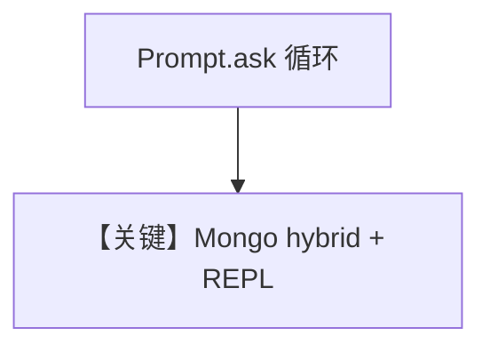

# mongo_db_hybrid_search.py — 实现原理分析

> 源文件：`cookbook/07_knowledge/09_archive/vector_dbs/mongo_db_hybrid_search.py`

## 概述

**`MongoVectorDb`** + **`SearchType.hybrid`**；**`typer` + `rich.prompt`** 交互循环 **`mongodb_agent`**，输入 `exit`/`bye` 退出。

**核心配置一览：**

| 配置项 | 值 | 说明 |
|--------|-----|------|
| `user_id` | 可传参 | 多用户会话标识 |

## 核心组件解析

混合检索需索引支持 **全文 + 向量**（Atlas 搜索索引定义）。

## System Prompt 组装

`search_knowledge=True` + knowledge 段。

## 完整 API 请求

每轮 `print_response` 一次 Chat Completions。

## Mermaid 流程图

## 关键源码文件索引

| 文件 | 作用 |
|------|------|
| `agno/vectordb/mongodb/` | |
| `agno/vectordb/search.py` | `SearchType` |
