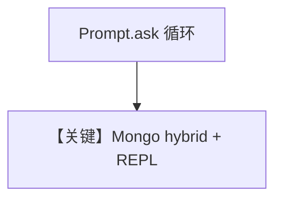

# mongo_db_hybrid_search.py — 实现原理分析

<!-- cookbook-py-source:start -->
## 完整源码

```python
"""
MongoDB Hybrid Search
=====================

Demonstrates MongoDB vector + keyword hybrid retrieval.
"""

import typer
from agno.agent import Agent
from agno.knowledge.knowledge import Knowledge
from agno.vectordb.mongodb import MongoVectorDb
from agno.vectordb.search import SearchType
from rich.prompt import Prompt

# ---------------------------------------------------------------------------
# Setup
# ---------------------------------------------------------------------------
mdb_connection_string = "mongodb+srv://<username>:<password>@cluster0.mongodb.net/?retryWrites=true&w=majority"

vector_db = MongoVectorDb(
    collection_name="recipes",
    db_url=mdb_connection_string,
    search_index_name="recipes",
    search_type=SearchType.hybrid,
)


# ---------------------------------------------------------------------------
# Create Knowledge Base
# ---------------------------------------------------------------------------
knowledge_base = Knowledge(vector_db=vector_db)


# ---------------------------------------------------------------------------
# Create Agent
# ---------------------------------------------------------------------------
def mongodb_agent(user: str = "user"):
    agent = Agent(
        user_id=user,
        knowledge=knowledge_base,
        search_knowledge=True,
    )

    while True:
        message = Prompt.ask(f"[bold]{user}[/bold]")
        if message in ("exit", "bye"):
            break
        agent.print_response(message)


# ---------------------------------------------------------------------------
# Run Agent
# ---------------------------------------------------------------------------
def main() -> None:
    knowledge_base.insert(
        name="Recipes",
        url="https://agno-public.s3.amazonaws.com/recipes/ThaiRecipes.pdf",
        metadata={"doc_type": "recipe_book"},
    )
    typer.run(mongodb_agent)


if __name__ == "__main__":
    main()
```

<!-- cookbook-py-source:end -->

> 源文件：`cookbook/07_knowledge/09_archive/vector_dbs/mongo_db_hybrid_search.py`

## 概述

**`MongoVectorDb`** + **`SearchType.hybrid`**；**`typer` + `rich.prompt`** 交互循环 **`mongodb_agent`**，输入 `exit`/`bye` 退出。

**核心配置一览：**

| 配置项 | 值 | 说明 |
|--------|-----|------|
| `user_id` | 可传参 | 多用户会话标识 |

## 核心组件解析

混合检索需索引支持 **全文 + 向量**（Atlas 搜索索引定义）。

## System Prompt 组装

`search_knowledge=True` + knowledge 段。

## 完整 API 请求

每轮 `print_response` 一次 Chat Completions。

## Mermaid 流程图



## 关键源码文件索引

| 文件 | 作用 |
|------|------|
| `agno/vectordb/mongodb/` | |
| `agno/vectordb/search.py` | `SearchType` |
