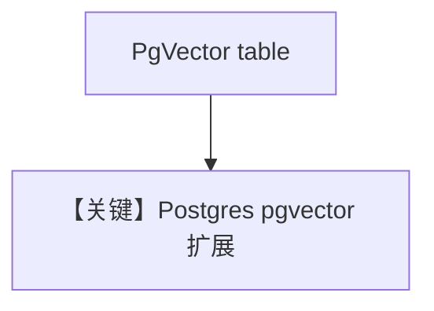

# pgvector_db.py — 实现原理分析

> 源文件：`cookbook/07_knowledge/09_archive/vector_dbs/pgvector_db.py`

## 概述

**`PgVector`** 标准示例：**`postgresql+psycopg`**，同步/异步/batch；**`read_chat_history=True`**。

**核心配置一览：**

| 配置项 | 值 | 说明 |
|--------|-----|------|
| `db_url` | 本地 5532 | 与 cookbook PG 一致 |

## 核心组件解析

PgVector 与 Postgres 事务共存，适合生产 RAG。

## System Prompt 组装

`read_chat_history=True` 时可能附加历史（见 `_messages.py` 历史段）；knowledge 段仍默认。

## 完整 API 请求

默认 `gpt-4o`。

## Mermaid 流程图

## 关键源码文件索引

| 文件 | 作用 |
|------|------|
| `agno/vectordb/pgvector/` | |
