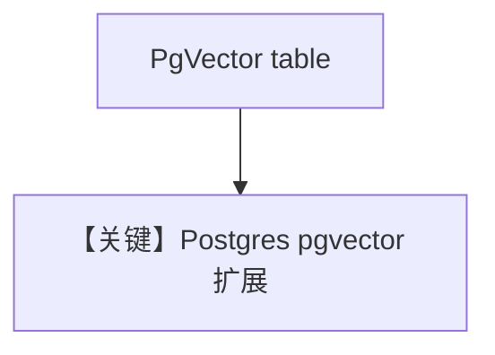

# pgvector_db.py — 实现原理分析

<!-- cookbook-py-source:start -->
## 完整源码

```python
"""
PgVector Database
=================

Demonstrates PgVector-backed knowledge with sync, async, and async-batching flows.
"""

import asyncio

from agno.agent import Agent
from agno.knowledge.embedder.openai import OpenAIEmbedder
from agno.knowledge.knowledge import Knowledge
from agno.vectordb.pgvector import PgVector

# ---------------------------------------------------------------------------
# Setup
# ---------------------------------------------------------------------------
db_url = "postgresql+psycopg://ai:ai@localhost:5532/ai"


# ---------------------------------------------------------------------------
# Create Knowledge Base
# ---------------------------------------------------------------------------
def create_sync_knowledge() -> tuple[Knowledge, PgVector]:
    vector_db = PgVector(table_name="vectors", db_url=db_url)
    knowledge = Knowledge(
        name="My PG Vector Knowledge Base",
        description="This is a knowledge base that uses a PG Vector DB",
        vector_db=vector_db,
    )
    return knowledge, vector_db


def create_async_knowledge(enable_batch: bool = False) -> tuple[Knowledge, PgVector]:
    if enable_batch:
        vector_db = PgVector(
            table_name="recipes",
            db_url=db_url,
            embedder=OpenAIEmbedder(enable_batch=True),
        )
    else:
        vector_db = PgVector(table_name="recipes", db_url=db_url)
    knowledge = Knowledge(vector_db=vector_db)
    return knowledge, vector_db


# ---------------------------------------------------------------------------
# Create Agent
# ---------------------------------------------------------------------------
def create_sync_agent(knowledge: Knowledge) -> Agent:
    return Agent(
        knowledge=knowledge,
        search_knowledge=True,
        read_chat_history=True,
    )


def create_async_agent(knowledge: Knowledge) -> Agent:
    return Agent(knowledge=knowledge)


# ---------------------------------------------------------------------------
# Run Agent
# ---------------------------------------------------------------------------
def run_sync() -> None:
    knowledge, vector_db = create_sync_knowledge()
    knowledge.insert(
        name="Recipes",
        url="https://agno-public.s3.amazonaws.com/recipes/ThaiRecipes.pdf",
        metadata={"doc_type": "recipe_book"},
    )

    agent = create_sync_agent(knowledge)
    agent.print_response("How do I make pad thai?", markdown=True)

    vector_db.delete_by_name("Recipes")
    vector_db.delete_by_metadata({"doc_type": "recipe_book"})


async def run_async(enable_batch: bool = False) -> None:
    knowledge, _ = create_async_knowledge(enable_batch=enable_batch)
    agent = create_async_agent(knowledge)

    await knowledge.ainsert(url="https://docs.agno.com/agents/overview.md")
    await agent.aprint_response("What is the purpose of an Agno Agent?", markdown=True)


if __name__ == "__main__":
    run_sync()
    asyncio.run(run_async(enable_batch=False))
    asyncio.run(run_async(enable_batch=True))
```

<!-- cookbook-py-source:end -->

> 源文件：`cookbook/07_knowledge/09_archive/vector_dbs/pgvector_db.py`

## 概述

**`PgVector`** 标准示例：**`postgresql+psycopg`**，同步/异步/batch；**`read_chat_history=True`**。

**核心配置一览：**

| 配置项 | 值 | 说明 |
|--------|-----|------|
| `db_url` | 本地 5532 | 与 cookbook PG 一致 |

## 核心组件解析

PgVector 与 Postgres 事务共存，适合生产 RAG。

## System Prompt 组装

`read_chat_history=True` 时可能附加历史（见 `_messages.py` 历史段）；knowledge 段仍默认。

## 完整 API 请求

默认 `gpt-4o`。

## Mermaid 流程图



## 关键源码文件索引

| 文件 | 作用 |
|------|------|
| `agno/vectordb/pgvector/` | |
