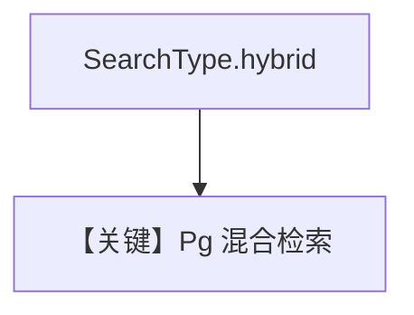

# pgvector_hybrid_search.py — 实现原理分析

<!-- cookbook-py-source:start -->
## 完整源码

```python
"""
PgVector Hybrid Search
======================

Demonstrates PgVector hybrid search with conversational memory.
"""

from agno.agent import Agent
from agno.knowledge.knowledge import Knowledge
from agno.models.openai import OpenAIChat
from agno.vectordb.pgvector import PgVector, SearchType

# ---------------------------------------------------------------------------
# Setup
# ---------------------------------------------------------------------------
db_url = "postgresql+psycopg://ai:ai@localhost:5532/ai"


# ---------------------------------------------------------------------------
# Create Knowledge Base
# ---------------------------------------------------------------------------
knowledge = Knowledge(
    name="My PG Vector Knowledge Base",
    description="This is a knowledge base that uses a PG Vector DB",
    vector_db=PgVector(
        table_name="vectors",
        db_url=db_url,
        search_type=SearchType.hybrid,
    ),
)


# ---------------------------------------------------------------------------
# Create Agent
# ---------------------------------------------------------------------------
agent = Agent(
    model=OpenAIChat(id="gpt-4o"),
    knowledge=knowledge,
    search_knowledge=True,
    read_chat_history=True,
    markdown=True,
)


# ---------------------------------------------------------------------------
# Run Agent
# ---------------------------------------------------------------------------
def main() -> None:
    knowledge.insert(
        name="Recipes",
        url="https://agno-public.s3.amazonaws.com/recipes/ThaiRecipes.pdf",
        metadata={"doc_type": "recipe_book"},
    )
    agent.print_response(
        "How do I make chicken and galangal in coconut milk soup", stream=True
    )
    agent.print_response("What was my last question?", stream=True)


if __name__ == "__main__":
    main()
```

<!-- cookbook-py-source:end -->

> 源文件：`cookbook/07_knowledge/09_archive/vector_dbs/pgvector_hybrid_search.py`

## 概述

**`PgVector`** + **`SearchType.hybrid`**；**`OpenAIChat(id="gpt-4o")`**，**`read_chat_history=True`**，**`markdown=True`**，流式 `print_response` 问泰式汤。

**核心配置一览：**

| 配置项 | 值 | 说明 |
|--------|-----|------|

## 核心组件解析

PG 混合常结合 tsvector/GIN 与向量（实现见 `PgVector`）。

## System Prompt 组装

description + knowledge + 历史（若 session 有记录）。

## 完整 API 请求

`gpt-4o` 流式。

## Mermaid 流程图



## 关键源码文件索引

| 文件 | 作用 |
|------|------|
| `agno/vectordb/pgvector/` | |
