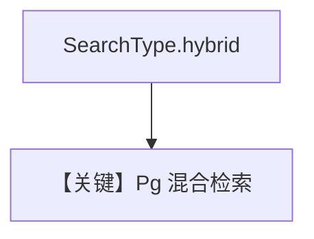

# pgvector_hybrid_search.py — 实现原理分析

> 源文件：`cookbook/07_knowledge/09_archive/vector_dbs/pgvector_hybrid_search.py`

## 概述

**`PgVector`** + **`SearchType.hybrid`**；**`OpenAIChat(id="gpt-4o")`**，**`read_chat_history=True`**，**`markdown=True`**，流式 `print_response` 问泰式汤。

**核心配置一览：**

| 配置项 | 值 | 说明 |
|--------|-----|------|

## 核心组件解析

PG 混合常结合 tsvector/GIN 与向量（实现见 `PgVector`）。

## System Prompt 组装

description + knowledge + 历史（若 session 有记录）。

## 完整 API 请求

`gpt-4o` 流式。

## Mermaid 流程图

## 关键源码文件索引

| 文件 | 作用 |
|------|------|
| `agno/vectordb/pgvector/` | |
