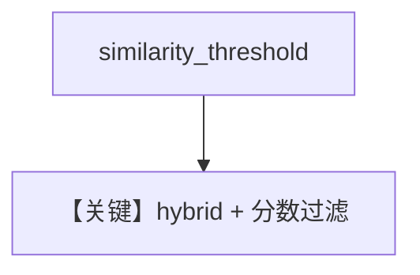

# pgvector_hybrid_similarity_threshold.py — 实现原理分析

> 源文件：`cookbook/07_knowledge/09_archive/vector_dbs/pgvector_hybrid_similarity_threshold.py`

## 概述

**`similarity_threshold=0.2`** + **`SearchType.hybrid`**；仅用 **`text_content`** 插入三段，`skip_if_exists=True`；**无 Agent**，**`vector_db.search` 打印分数**。

**核心配置一览：**

| 配置项 | 值 | 说明 |
|--------|-----|------|
| 查询 | `"What is the weather today?"` | 检验阈值过滤无关块 |

## 核心组件解析

阈值丢弃低相似结果，避免「天气」问题命中泰餐文本（理想情况下）。

## System Prompt 组装

无 Agent。

## 完整 API 请求

无 LLM。

## Mermaid 流程图

## 关键源码文件索引

| 文件 | 作用 |
|------|------|
| `agno/vectordb/pgvector/` | |
