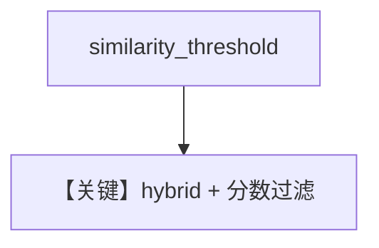

# pgvector_hybrid_similarity_threshold.py — 实现原理分析

<!-- cookbook-py-source:start -->
## 完整源码

```python
from agno.knowledge.knowledge import Knowledge
from agno.vectordb.pgvector import PgVector
from agno.vectordb.search import SearchType

db_url = "postgresql+psycopg://ai:ai@localhost:5532/ai"

vector_db = PgVector(
    table_name="vectors_hybrid",
    db_url=db_url,
    search_type=SearchType.hybrid,
    similarity_threshold=0.2,
)

knowledge = Knowledge(
    name="Thai Recipes",
    description="Knowledge base with Thai recipes",
    vector_db=vector_db,
)

knowledge.insert(
    name="thai_curry",
    text_content="Thai green curry is a spicy dish made with coconut milk and green chilies.",
    skip_if_exists=True,
)
knowledge.insert(
    name="pad_thai",
    text_content="Pad Thai is a stir-fried rice noodle dish commonly served as street food in Thailand.",
    skip_if_exists=True,
)
knowledge.insert(
    name="weather",
    text_content="The weather forecast shows sunny skies with temperatures around 75 degrees.",
    skip_if_exists=True,
)

query = "What is the weather today?"

results = vector_db.search(query, limit=5)
print(f"Query: '{query}'")
print(f"Chunks retrieved: {len(results)}")
for i, doc in enumerate(results):
    score = doc.meta_data.get("similarity_score", 0)
    print(f"{i + 1}. score={score:.3f}, {doc.content}")
```

<!-- cookbook-py-source:end -->

> 源文件：`cookbook/07_knowledge/09_archive/vector_dbs/pgvector_hybrid_similarity_threshold.py`

## 概述

**`similarity_threshold=0.2`** + **`SearchType.hybrid`**；仅用 **`text_content`** 插入三段，`skip_if_exists=True`；**无 Agent**，**`vector_db.search` 打印分数**。

**核心配置一览：**

| 配置项 | 值 | 说明 |
|--------|-----|------|
| 查询 | `"What is the weather today?"` | 检验阈值过滤无关块 |

## 核心组件解析

阈值丢弃低相似结果，避免「天气」问题命中泰餐文本（理想情况下）。

## System Prompt 组装

无 Agent。

## 完整 API 请求

无 LLM。

## Mermaid 流程图



## 关键源码文件索引

| 文件 | 作用 |
|------|------|
| `agno/vectordb/pgvector/` | |
