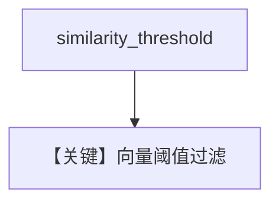

# pgvector_similarity_threshold.py — 实现原理分析

<!-- cookbook-py-source:start -->
## 完整源码

```python
from agno.knowledge.knowledge import Knowledge
from agno.vectordb.pgvector import PgVector

db_url = "postgresql+psycopg://ai:ai@localhost:5532/ai"

vector_db = PgVector(
    table_name="vectors",
    db_url=db_url,
    similarity_threshold=0.2,
)

knowledge = Knowledge(
    name="Thai Recipes",
    description="Knowledge base with Thai recipes",
    vector_db=vector_db,
)

knowledge.insert(
    name="thai_curry",
    text_content="Thai green curry is a spicy dish made with coconut milk and green chilies.",
    skip_if_exists=True,
)
knowledge.insert(
    name="pad_thai",
    text_content="Pad Thai is a stir-fried rice noodle dish commonly served as street food in Thailand.",
    skip_if_exists=True,
)
knowledge.insert(
    name="weather",
    text_content="The weather forecast shows sunny skies with temperatures around 75 degrees.",
    skip_if_exists=True,
)

query = "What is the weather in Tokyo?"

results = vector_db.search(query, limit=5)
print(f"Query: '{query}'")
print(f"Chunks retrieved: {len(results)}")
for i, doc in enumerate(results):
    score = doc.meta_data.get("similarity_score", 0)
    print(f"{i + 1}. score={score:.3f}, {doc.content}")
```

<!-- cookbook-py-source:end -->

> 源文件：`cookbook/07_knowledge/09_archive/vector_dbs/pgvector_similarity_threshold.py`

## 概述

**纯向量**（默认 `SearchType.vector`）+ **`similarity_threshold=0.2`**；`text_content` 三则；查询 **`What is the weather in Tokyo?`**；打印 **`similarity_score`**。

**核心配置一览：**

| 配置项 | 值 | 说明 |
|--------|-----|------|
| 无 `search_type` | 默认向量 | 与 hybrid 阈值版对照 |

## 核心组件解析

阈值在向量近邻后过滤，与 hybrid 版对比理解 **检索模式差异**。

## System Prompt 组装

无 Agent。

## 完整 API 请求

无。

## Mermaid 流程图



## 关键源码文件索引

| 文件 | 作用 |
|------|------|
| `agno/vectordb/pgvector/` | |
