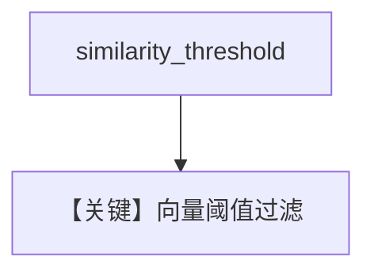

# pgvector_similarity_threshold.py — 实现原理分析

> 源文件：`cookbook/07_knowledge/09_archive/vector_dbs/pgvector_similarity_threshold.py`

## 概述

**纯向量**（默认 `SearchType.vector`）+ **`similarity_threshold=0.2`**；`text_content` 三则；查询 **`What is the weather in Tokyo?`**；打印 **`similarity_score`**。

**核心配置一览：**

| 配置项 | 值 | 说明 |
|--------|-----|------|
| 无 `search_type` | 默认向量 | 与 hybrid 阈值版对照 |

## 核心组件解析

阈值在向量近邻后过滤，与 hybrid 版对比理解 **检索模式差异**。

## System Prompt 组装

无 Agent。

## 完整 API 请求

无。

## Mermaid 流程图

## 关键源码文件索引

| 文件 | 作用 |
|------|------|
| `agno/vectordb/pgvector/` | |
