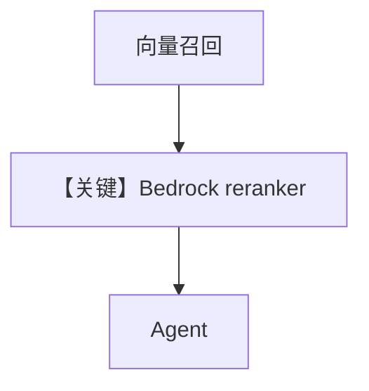

# pgvector_with_bedrock_reranker.py — 实现原理分析

> 源文件：`cookbook/07_knowledge/09_archive/vector_dbs/pgvector_with_bedrock_reranker.py`

## 概述

**`PgVector`** + **`AwsBedrockEmbedder`** + **`AwsBedrockReranker` / `CohereBedrockReranker`**；两枚 **`Knowledge`** 实例不同表名与 reranker 封装；**`AwsBedrock`** 聊天模型。

**核心配置一览：**

| 配置项 | 值 | 说明 |
|--------|-----|------|
| AWS | `AWS_ACCESS_KEY_ID` 等 | boto3 |

## 核心组件解析

**两阶段**：向量召回 Top-K → **Bedrock rerank** 重排 → 再交给 Agent（具体链路由 `Knowledge`/`PgVector` 实现）。

## System Prompt 组装

默认 knowledge 段。

## 完整 API 请求

Bedrock Chat + Bedrock Embed + Bedrock Rerank。

## Mermaid 流程图

## 关键源码文件索引

| 文件 | 作用 |
|------|------|
| `agno/knowledge/reranker/aws_bedrock.py` | |
| `agno/vectordb/pgvector/` | |
