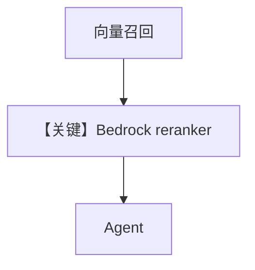

# pgvector_with_bedrock_reranker.py — 实现原理分析

<!-- cookbook-py-source:start -->
## 完整源码

```python
"""
AWS Bedrock Reranker Example with PgVector
==========================================

Demonstrates AWS Bedrock rerankers with PgVector for retrieval augmented generation.

Requirements:
- AWS credentials (AWS_ACCESS_KEY_ID, AWS_SECRET_ACCESS_KEY)
- AWS region configured (AWS_REGION)
- boto3 installed: pip install boto3
- PostgreSQL with pgvector running
"""

from agno.agent import Agent
from agno.knowledge.embedder.aws_bedrock import AwsBedrockEmbedder
from agno.knowledge.knowledge import Knowledge
from agno.knowledge.reranker.aws_bedrock import (
    AmazonReranker,
    AwsBedrockReranker,
    CohereBedrockReranker,
)
from agno.models.aws.bedrock import AwsBedrock
from agno.vectordb.pgvector import PgVector

# ---------------------------------------------------------------------------
# Create Knowledge Base
# ---------------------------------------------------------------------------
knowledge_cohere = Knowledge(
    vector_db=PgVector(
        table_name="bedrock_rag_demo",
        db_url="postgresql+psycopg://ai:ai@localhost:5532/ai",
        embedder=AwsBedrockEmbedder(
            id="cohere.embed-multilingual-v3",
            input_type="search_document",
        ),
        reranker=AwsBedrockReranker(
            model="cohere.rerank-v3-5:0",
            top_n=5,
        ),
    ),
)

knowledge_convenience = Knowledge(
    vector_db=PgVector(
        table_name="bedrock_rag_demo_v2",
        db_url="postgresql+psycopg://ai:ai@localhost:5532/ai",
        embedder=AwsBedrockEmbedder(
            id="cohere.embed-v4:0",
            output_dimension=1024,
            input_type="search_document",
        ),
        reranker=CohereBedrockReranker(top_n=5),
    ),
)

knowledge_amazon = Knowledge(
    vector_db=PgVector(
        table_name="bedrock_rag_amazon",
        db_url="postgresql+psycopg://ai:ai@localhost:5532/ai",
        embedder=AwsBedrockEmbedder(
            id="cohere.embed-multilingual-v3",
            input_type="search_document",
        ),
        reranker=AmazonReranker(
            top_n=5,
            aws_region="us-west-2",
        ),
    ),
)


# ---------------------------------------------------------------------------
# Create Agent
# ---------------------------------------------------------------------------
agent = Agent(
    model=AwsBedrock(id="anthropic.claude-sonnet-4-20250514-v1:0"),
    knowledge=knowledge_cohere,
    markdown=True,
)


# ---------------------------------------------------------------------------
# Run Agent
# ---------------------------------------------------------------------------
def main() -> None:
    knowledge_cohere.insert(
        name="Agno Docs", url="https://docs.agno.com/introduction.md"
    )
    _ = knowledge_convenience
    _ = knowledge_amazon
    agent.print_response("What are the key features?")


if __name__ == "__main__":
    main()
```

<!-- cookbook-py-source:end -->

> 源文件：`cookbook/07_knowledge/09_archive/vector_dbs/pgvector_with_bedrock_reranker.py`

## 概述

**`PgVector`** + **`AwsBedrockEmbedder`** + **`AwsBedrockReranker` / `CohereBedrockReranker`**；两枚 **`Knowledge`** 实例不同表名与 reranker 封装；**`AwsBedrock`** 聊天模型。

**核心配置一览：**

| 配置项 | 值 | 说明 |
|--------|-----|------|
| AWS | `AWS_ACCESS_KEY_ID` 等 | boto3 |

## 核心组件解析

**两阶段**：向量召回 Top-K → **Bedrock rerank** 重排 → 再交给 Agent（具体链路由 `Knowledge`/`PgVector` 实现）。

## System Prompt 组装

默认 knowledge 段。

## 完整 API 请求

Bedrock Chat + Bedrock Embed + Bedrock Rerank。

## Mermaid 流程图



## 关键源码文件索引

| 文件 | 作用 |
|------|------|
| `agno/knowledge/reranker/aws_bedrock.py` | |
| `agno/vectordb/pgvector/` | |
