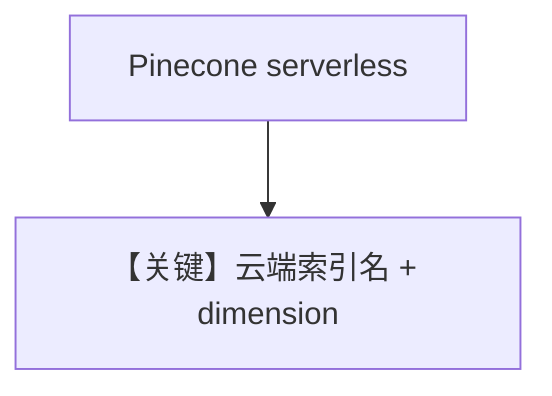

# pinecone_db.py — 实现原理分析

> 源文件：`cookbook/07_knowledge/09_archive/vector_dbs/pinecone_db.py`

## 概述

**`PineconeDb`**：**`PINECONE_API_KEY`**，**serverless** `spec`（aws/us-east-1），**dimension=1536**；同步与 **async batch** 两路。

**核心配置一览：**

| 配置项 | 值 | 说明 |
|--------|-----|------|
| `index_name` | `thai-recipe-index` / `recipe-documents` | |

## 核心组件解析

Pinecone 全托管索引；需云端建维与 metric 一致。

## System Prompt 组装

默认 knowledge 段。

## 完整 API 请求

`OpenAIChat` + OpenAI Embeddings。

## Mermaid 流程图

## 关键源码文件索引

| 文件 | 作用 |
|------|------|
| `agno/vectordb/pineconedb/` | |
