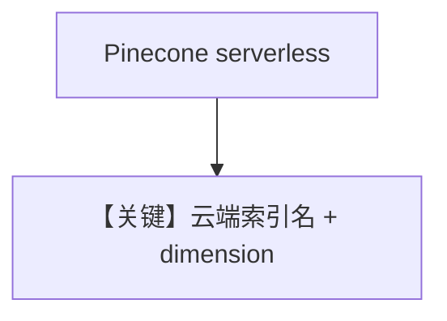

# pinecone_db.py — 实现原理分析

<!-- cookbook-py-source:start -->
## 完整源码

```python
"""
Pinecone Database
=================

Demonstrates Pinecone-backed knowledge with sync and async-batching flows.
"""

import asyncio
from os import getenv

from agno.agent import Agent
from agno.knowledge.embedder.openai import OpenAIEmbedder
from agno.knowledge.knowledge import Knowledge
from agno.models.openai import OpenAIChat
from agno.vectordb.pineconedb import PineconeDb

# ---------------------------------------------------------------------------
# Setup
# ---------------------------------------------------------------------------
api_key = getenv("PINECONE_API_KEY")
index_name = "thai-recipe-index"


# ---------------------------------------------------------------------------
# Create Knowledge Base
# ---------------------------------------------------------------------------
def create_sync_knowledge() -> tuple[Knowledge, PineconeDb]:
    vector_db = PineconeDb(
        name=index_name,
        dimension=1536,
        metric="cosine",
        spec={"serverless": {"cloud": "aws", "region": "us-east-1"}},
        api_key=api_key,
    )
    knowledge = Knowledge(
        name="My Pinecone Knowledge Base",
        description="This is a knowledge base that uses a Pinecone Vector DB",
        vector_db=vector_db,
    )
    return knowledge, vector_db


def create_async_batch_knowledge() -> Knowledge:
    return Knowledge(
        vector_db=PineconeDb(
            name="recipe-documents",
            dimension=1536,
            spec={"serverless": {"cloud": "aws", "region": "us-east-1"}},
            api_key=getenv("PINECONE_API_KEY"),
            embedder=OpenAIEmbedder(enable_batch=True),
        )
    )


# ---------------------------------------------------------------------------
# Create Agent
# ---------------------------------------------------------------------------
def create_sync_agent(knowledge: Knowledge) -> Agent:
    return Agent(knowledge=knowledge, search_knowledge=True, read_chat_history=True)


def create_async_batch_agent(knowledge: Knowledge) -> Agent:
    return Agent(
        model=OpenAIChat(id="gpt-5.2"),
        knowledge=knowledge,
        search_knowledge=True,
        read_chat_history=True,
    )


# ---------------------------------------------------------------------------
# Run Agent
# ---------------------------------------------------------------------------
def run_sync() -> None:
    knowledge, vector_db = create_sync_knowledge()
    knowledge.insert(
        name="Recipes",
        url="https://agno-public.s3.amazonaws.com/recipes/ThaiRecipes.pdf",
        metadata={"doc_type": "recipe_book"},
    )

    agent = create_sync_agent(knowledge)
    agent.print_response("How do I make pad thai?", markdown=True)

    vector_db.delete_by_name("Recipes")
    vector_db.delete_by_metadata({"doc_type": "recipe_book"})


async def run_async_batch() -> None:
    knowledge = create_async_batch_knowledge()
    agent = create_async_batch_agent(knowledge)

    await knowledge.ainsert(path="cookbook/07_knowledge/testing_resources/cv_1.pdf")
    await agent.aprint_response(
        "What can you tell me about the candidate and what are his skills?",
        markdown=True,
    )


if __name__ == "__main__":
    run_sync()
    asyncio.run(run_async_batch())
```

<!-- cookbook-py-source:end -->

> 源文件：`cookbook/07_knowledge/09_archive/vector_dbs/pinecone_db.py`

## 概述

**`PineconeDb`**：**`PINECONE_API_KEY`**，**serverless** `spec`（aws/us-east-1），**dimension=1536**；同步与 **async batch** 两路。

**核心配置一览：**

| 配置项 | 值 | 说明 |
|--------|-----|------|
| `index_name` | `thai-recipe-index` / `recipe-documents` | |

## 核心组件解析

Pinecone 全托管索引；需云端建维与 metric 一致。

## System Prompt 组装

默认 knowledge 段。

## 完整 API 请求

`OpenAIChat` + OpenAI Embeddings。

## Mermaid 流程图



## 关键源码文件索引

| 文件 | 作用 |
|------|------|
| `agno/vectordb/pineconedb/` | |
