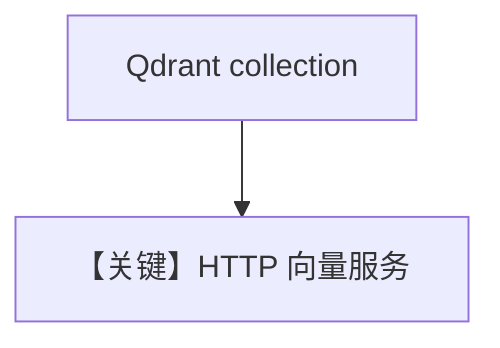

# qdrant_db.py — 实现原理分析

> 源文件：`cookbook/07_knowledge/09_archive/vector_dbs/qdrant_db.py`

## 概述

**`Qdrant`** **`http://localhost:6333`**；同步路径 **`PostgresDb` contents**；异步 batch **`OpenAIEmbedder(enable_batch=True)`**。

**核心配置一览：**

| 配置项 | 值 | 说明 |
|--------|-----|------|
| `COLLECTION_NAME` | `thai-recipes` | |

## 核心组件解析

Qdrant 独立向量服务；与 PG contents 组合实现「向量+内容」双写。

## System Prompt 组装

默认 knowledge 段。

## 完整 API 请求

`OpenAIChat`。

## Mermaid 流程图

## 关键源码文件索引

| 文件 | 作用 |
|------|------|
| `agno/vectordb/qdrant/` | |
