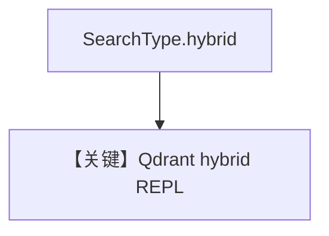

# qdrant_db_hybrid_search.py — 实现原理分析

<!-- cookbook-py-source:start -->
## 完整源码

```python
"""
Qdrant Hybrid Search
====================

Demonstrates Qdrant hybrid retrieval in an interactive loop.
"""

import typer
from agno.agent import Agent
from agno.knowledge.knowledge import Knowledge
from agno.vectordb.qdrant import Qdrant
from agno.vectordb.search import SearchType
from rich.prompt import Prompt

# ---------------------------------------------------------------------------
# Setup
# ---------------------------------------------------------------------------
COLLECTION_NAME = "thai-recipes"
vector_db = Qdrant(
    collection=COLLECTION_NAME,
    url="http://localhost:6333",
    search_type=SearchType.hybrid,
)


# ---------------------------------------------------------------------------
# Create Knowledge Base
# ---------------------------------------------------------------------------
knowledge = Knowledge(
    name="My Qdrant Vector Knowledge Base",
    vector_db=vector_db,
)


# ---------------------------------------------------------------------------
# Create Agent
# ---------------------------------------------------------------------------
def qdrantdb_agent(user: str = "user"):
    agent = Agent(
        user_id=user,
        knowledge=knowledge,
        search_knowledge=True,
    )

    while True:
        message = Prompt.ask(f"[bold]{user}[/bold]")
        if message in ("exit", "bye"):
            break
        agent.print_response(message)


# ---------------------------------------------------------------------------
# Run Agent
# ---------------------------------------------------------------------------
def main() -> None:
    knowledge.insert(
        name="Recipes",
        url="https://agno-public.s3.amazonaws.com/recipes/ThaiRecipes.pdf",
        metadata={"doc_type": "recipe_book"},
    )
    typer.run(qdrantdb_agent)


if __name__ == "__main__":
    main()
```

<!-- cookbook-py-source:end -->

> 源文件：`cookbook/07_knowledge/09_archive/vector_dbs/qdrant_db_hybrid_search.py`

## 概述

**`Qdrant`** + **`SearchType.hybrid`**；**`typer` + `rich.prompt`** REPL，同 `mongo_db_hybrid_search` 交互模式。

**核心配置一览：**

| 配置项 | 值 | 说明 |
|--------|-----|------|

## 核心组件解析

Qdrant 混合检索依赖 collection 上配置的稀疏/稠密向量（见 Qdrant 文档与适配器）。

## System Prompt 组装

`search_knowledge=True`。

## 完整 API 请求

循环 `print_response`。

## Mermaid 流程图



## 关键源码文件索引

| 文件 | 作用 |
|------|------|
| `agno/vectordb/qdrant/` | |
