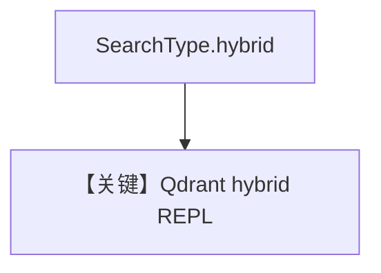

# qdrant_db_hybrid_search.py — 实现原理分析

> 源文件：`cookbook/07_knowledge/09_archive/vector_dbs/qdrant_db_hybrid_search.py`

## 概述

**`Qdrant`** + **`SearchType.hybrid`**；**`typer` + `rich.prompt`** REPL，同 `mongo_db_hybrid_search` 交互模式。

**核心配置一览：**

| 配置项 | 值 | 说明 |
|--------|-----|------|

## 核心组件解析

Qdrant 混合检索依赖 collection 上配置的稀疏/稠密向量（见 Qdrant 文档与适配器）。

## System Prompt 组装

`search_knowledge=True`。

## 完整 API 请求

循环 `print_response`。

## Mermaid 流程图

## 关键源码文件索引

| 文件 | 作用 |
|------|------|
| `agno/vectordb/qdrant/` | |
