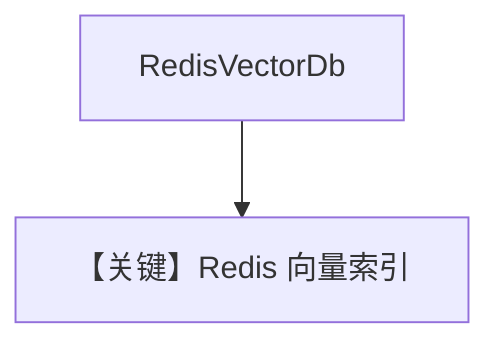

# redis_db.py — 实现原理分析

> 源文件：`cookbook/07_knowledge/09_archive/vector_dbs/redis_db.py`

## 概述

**`RedisVectorDb`**：**`REDIS_URL`** / **`run_redis.sh`**，**`SearchType.vector`**，插入食谱 PDF。

**核心配置一览：**

| 配置项 | 值 | 说明 |
|--------|-----|------|
| `INDEX_NAME` | `agno_cookbook_vectors` | |

## 核心组件解析

Redis + RedisVL 向量索引；适合低延迟缓存型 RAG。

## System Prompt 组装

默认 knowledge 段。

## 完整 API 请求

默认 `gpt-4o`。

## Mermaid 流程图

## 关键源码文件索引

| 文件 | 作用 |
|------|------|
| `agno/vectordb/redis/` | |
