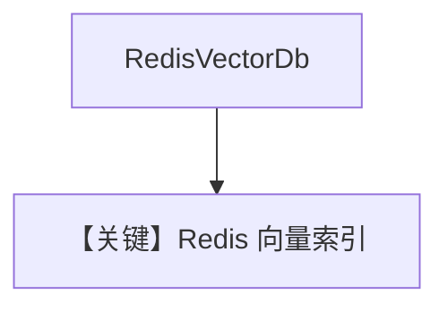

# redis_db.py — 实现原理分析

<!-- cookbook-py-source:start -->
## 完整源码

```python
"""
Redis Vector DB
===============

Demonstrates Redis-backed knowledge with sync and async flows.

To get started, either set `REDIS_URL`, or start local Redis with:
`./cookbook/scripts/run_redis.sh`
"""

import asyncio
import os

from agno.agent import Agent
from agno.knowledge.knowledge import Knowledge
from agno.vectordb.redis import RedisVectorDb
from agno.vectordb.search import SearchType

# ---------------------------------------------------------------------------
# Setup
# ---------------------------------------------------------------------------
REDIS_URL = os.getenv("REDIS_URL", "redis://localhost:6379/0")
INDEX_NAME = os.getenv("REDIS_INDEX", "agno_cookbook_vectors")

vector_db = RedisVectorDb(
    index_name=INDEX_NAME,
    redis_url=REDIS_URL,
    search_type=SearchType.vector,
)


# ---------------------------------------------------------------------------
# Create Knowledge Base
# ---------------------------------------------------------------------------
knowledge = Knowledge(
    name="My Redis Vector Knowledge Base",
    description="This knowledge base uses Redis + RedisVL as the vector store",
    vector_db=vector_db,
)


# ---------------------------------------------------------------------------
# Create Agent
# ---------------------------------------------------------------------------
agent = Agent(knowledge=knowledge)


# ---------------------------------------------------------------------------
# Run Agent
# ---------------------------------------------------------------------------
def run_sync() -> None:
    knowledge.insert(
        name="Recipes",
        url="https://agno-public.s3.amazonaws.com/recipes/ThaiRecipes.pdf",
        metadata={"doc_type": "recipe_book"},
        skip_if_exists=True,
    )
    agent.print_response(
        "List down the ingredients to make Massaman Gai", markdown=True
    )


async def run_async() -> None:
    await knowledge.ainsert(
        name="Recipes",
        url="https://agno-public.s3.amazonaws.com/recipes/ThaiRecipes.pdf",
        metadata={"doc_type": "recipe_book"},
        skip_if_exists=True,
    )
    await agent.aprint_response(
        "List down the ingredients to make Massaman Gai", markdown=True
    )


if __name__ == "__main__":
    run_sync()
    asyncio.run(run_async())
```

<!-- cookbook-py-source:end -->

> 源文件：`cookbook/07_knowledge/09_archive/vector_dbs/redis_db.py`

## 概述

**`RedisVectorDb`**：**`REDIS_URL`** / **`run_redis.sh`**，**`SearchType.vector`**，插入食谱 PDF。

**核心配置一览：**

| 配置项 | 值 | 说明 |
|--------|-----|------|
| `INDEX_NAME` | `agno_cookbook_vectors` | |

## 核心组件解析

Redis + RedisVL 向量索引；适合低延迟缓存型 RAG。

## System Prompt 组装

默认 knowledge 段。

## 完整 API 请求

默认 `gpt-4o`。

## Mermaid 流程图



## 关键源码文件索引

| 文件 | 作用 |
|------|------|
| `agno/vectordb/redis/` | |
