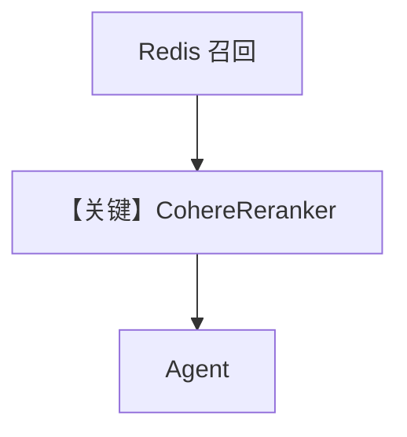

# redis_db_with_cohere_reranker.py — 实现原理分析

<!-- cookbook-py-source:start -->
## 完整源码

```python
"""
Redis With Cohere Reranker
==========================

Demonstrates Redis vector retrieval with Cohere reranking.
"""

from agno.agent import Agent
from agno.knowledge.embedder.openai import OpenAIEmbedder
from agno.knowledge.knowledge import Knowledge
from agno.knowledge.reranker.cohere import CohereReranker
from agno.models.openai import OpenAIChat
from agno.vectordb.redis import RedisDB

# ---------------------------------------------------------------------------
# Create Knowledge Base
# ---------------------------------------------------------------------------
knowledge = Knowledge(
    vector_db=RedisDB(
        index_name="agno_docs",
        redis_url="redis://localhost:6379",
        embedder=OpenAIEmbedder(id="text-embedding-3-small"),
        reranker=CohereReranker(model="rerank-multilingual-v3.0"),
    ),
)


# ---------------------------------------------------------------------------
# Create Agent
# ---------------------------------------------------------------------------
agent = Agent(
    model=OpenAIChat(id="gpt-5.2"),
    knowledge=knowledge,
    markdown=True,
)


# ---------------------------------------------------------------------------
# Run Agent
# ---------------------------------------------------------------------------
def main() -> None:
    knowledge.insert(name="Agno Docs", url="https://docs.agno.com/introduction.md")
    agent.print_response("What are Agno's key features?")


if __name__ == "__main__":
    main()
```

<!-- cookbook-py-source:end -->

> 源文件：`cookbook/07_knowledge/09_archive/vector_dbs/redis_db_with_cohere_reranker.py`

## 概述

**`RedisDB`**（注意类名与 `redis_db.py` 的 `RedisVectorDb` 可能不同，以源码为准）+ **`OpenAIEmbedder`** + **`CohereReranker`**；**`OpenAIChat(id="gpt-5.2")`**；插入 **`docs.agno.com/introduction.md`**。

**核心配置一览：**

| 配置项 | 值 | 说明 |
|--------|-----|------|
| `reranker` | `rerank-multilingual-v3.0` | Cohere API |

## 核心组件解析

向量召回后 **Cohere rerank** 提升相关性排序。

## System Prompt 组装

默认 knowledge 段。

## 完整 API 请求

`gpt-5.2` + Embeddings + Cohere Rerank。

## Mermaid 流程图



## 关键源码文件索引

| 文件 | 作用 |
|------|------|
| `agno/knowledge/reranker/cohere.py` | |
| `agno/vectordb/redis/` | `RedisDB` |
