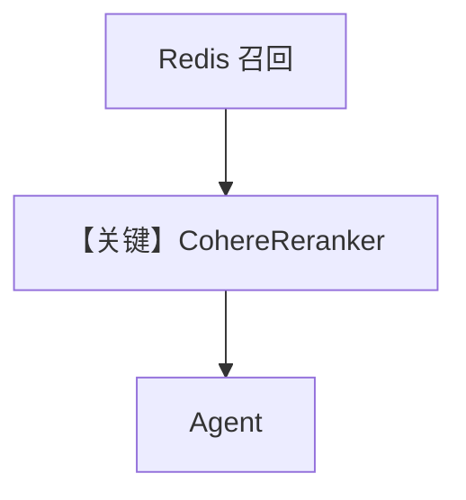

# redis_db_with_cohere_reranker.py — 实现原理分析

> 源文件：`cookbook/07_knowledge/09_archive/vector_dbs/redis_db_with_cohere_reranker.py`

## 概述

**`RedisDB`**（注意类名与 `redis_db.py` 的 `RedisVectorDb` 可能不同，以源码为准）+ **`OpenAIEmbedder`** + **`CohereReranker`**；**`OpenAIChat(id="gpt-5.2")`**；插入 **`docs.agno.com/introduction.md`**。

**核心配置一览：**

| 配置项 | 值 | 说明 |
|--------|-----|------|
| `reranker` | `rerank-multilingual-v3.0` | Cohere API |

## 核心组件解析

向量召回后 **Cohere rerank** 提升相关性排序。

## System Prompt 组装

默认 knowledge 段。

## 完整 API 请求

`gpt-5.2` + Embeddings + Cohere Rerank。

## Mermaid 流程图

## 关键源码文件索引

| 文件 | 作用 |
|------|------|
| `agno/knowledge/reranker/cohere.py` | |
| `agno/vectordb/redis/` | `RedisDB` |
