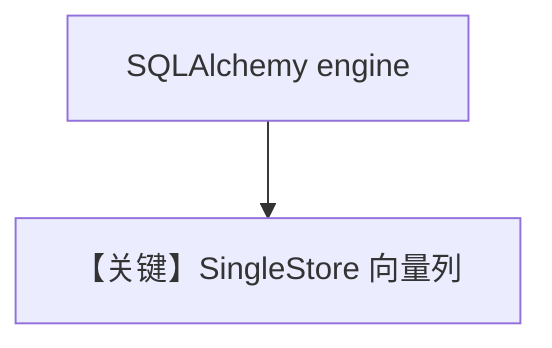

# singlestore_db.py — 实现原理分析

<!-- cookbook-py-source:start -->
## 完整源码

```python
"""
SingleStore Vector DB
=====================

Run setup script:
`./cookbook/scripts/run_singlestore.sh`

Then create a database in Studio (http://localhost:8080).
"""

import asyncio
from os import getenv

from agno.agent import Agent
from agno.knowledge.embedder.openai import OpenAIEmbedder
from agno.knowledge.knowledge import Knowledge
from agno.models.openai import OpenAIChat
from agno.vectordb.singlestore import SingleStore
from sqlalchemy.engine import create_engine

# ---------------------------------------------------------------------------
# Setup
# ---------------------------------------------------------------------------
USERNAME = getenv("SINGLESTORE_USERNAME")
PASSWORD = getenv("SINGLESTORE_PASSWORD")
HOST = getenv("SINGLESTORE_HOST")
PORT = getenv("SINGLESTORE_PORT")
DATABASE = getenv("SINGLESTORE_DATABASE")
SSL_CERT = getenv("SINGLESTORE_SSL_CERT", None)


def get_engine():
    db_url = f"mysql+pymysql://{USERNAME}:{PASSWORD}@{HOST}:{PORT}/{DATABASE}?charset=utf8mb4"
    if SSL_CERT:
        db_url += f"&ssl_ca={SSL_CERT}&ssl_verify_cert=true"
    return create_engine(db_url)


# ---------------------------------------------------------------------------
# Create Knowledge Base
# ---------------------------------------------------------------------------
def create_sync_knowledge() -> tuple[Knowledge, SingleStore]:
    vector_db = SingleStore(
        collection="recipes",
        db_engine=get_engine(),
        schema=DATABASE,
    )
    knowledge = Knowledge(name="My SingleStore Knowledge Base", vector_db=vector_db)
    return knowledge, vector_db


def create_async_batch_knowledge() -> Knowledge:
    vector_db = SingleStore(
        collection="documents",
        db_engine=get_engine(),
        schema=DATABASE,
        embedder=OpenAIEmbedder(enable_batch=True),
    )
    return Knowledge(vector_db=vector_db)


# ---------------------------------------------------------------------------
# Create Agent
# ---------------------------------------------------------------------------
def create_sync_agent(knowledge: Knowledge) -> Agent:
    return Agent(
        knowledge=knowledge,
        search_knowledge=True,
        read_chat_history=True,
    )


def create_async_batch_agent(knowledge: Knowledge) -> Agent:
    return Agent(
        model=OpenAIChat(id="gpt-5.2"),
        knowledge=knowledge,
        search_knowledge=True,
        read_chat_history=True,
    )


# ---------------------------------------------------------------------------
# Run Agent
# ---------------------------------------------------------------------------
def run_sync() -> None:
    knowledge, vector_db = create_sync_knowledge()
    knowledge.insert(
        name="Recipes",
        url="https://agno-public.s3.amazonaws.com/recipes/ThaiRecipes.pdf",
        metadata={"doc_type": "recipe_book"},
    )

    agent = create_sync_agent(knowledge)
    agent.print_response("How do I make pad thai?", markdown=True)

    vector_db.delete_by_name("Recipes")
    vector_db.delete_by_metadata({"doc_type": "recipe_book"})


async def run_async_batch() -> None:
    knowledge = create_async_batch_knowledge()
    agent = create_async_batch_agent(knowledge)

    await knowledge.ainsert(path="cookbook/07_knowledge/testing_resources/cv_1.pdf")
    await agent.aprint_response(
        "What can you tell me about the candidate and what are his skills?",
        markdown=True,
    )


if __name__ == "__main__":
    run_sync()
    asyncio.run(run_async_batch())
```

<!-- cookbook-py-source:end -->

> 源文件：`cookbook/07_knowledge/09_archive/vector_dbs/singlestore_db.py`

## 概述

**`SingleStore`**：通过 **`sqlalchemy.create_engine`** 拼 **MySQL 协议** URL；环境变量 **`SINGLESTORE_*`**；**`OpenAIChat`** + batch embed。

**核心配置一览：**

| 配置项 | 值 | 说明 |
|--------|-----|------|
| `collection` | `recipes` / `documents` | |

## 核心组件解析

SingleStore 兼关系与向量；`schema` 与 `db_engine` 绑定。

## System Prompt 组装

默认 knowledge 段。

## 完整 API 请求

OpenAI Chat + Embeddings。

## Mermaid 流程图



## 关键源码文件索引

| 文件 | 作用 |
|------|------|
| `agno/vectordb/singlestore/` | |
