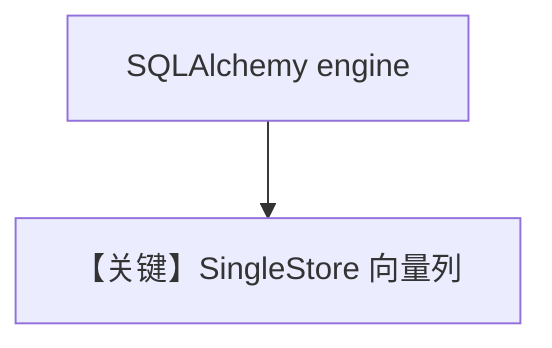

# singlestore_db.py — 实现原理分析

> 源文件：`cookbook/07_knowledge/09_archive/vector_dbs/singlestore_db.py`

## 概述

**`SingleStore`**：通过 **`sqlalchemy.create_engine`** 拼 **MySQL 协议** URL；环境变量 **`SINGLESTORE_*`**；**`OpenAIChat`** + batch embed。

**核心配置一览：**

| 配置项 | 值 | 说明 |
|--------|-----|------|
| `collection` | `recipes` / `documents` | |

## 核心组件解析

SingleStore 兼关系与向量；`schema` 与 `db_engine` 绑定。

## System Prompt 组装

默认 knowledge 段。

## 完整 API 请求

OpenAI Chat + Embeddings。

## Mermaid 流程图

## 关键源码文件索引

| 文件 | 作用 |
|------|------|
| `agno/vectordb/singlestore/` | |
