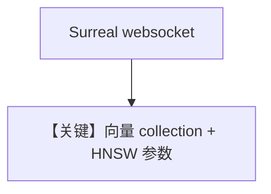

# surreal_db.py — 实现原理分析

> 源文件：`cookbook/07_knowledge/09_archive/vector_dbs/surreal_db.py`

## 概述

**`SurrealDb`**：**同步 `Surreal`** 与 **`AsyncSurreal`** 双客户端；**HNSW 参数** `efc`/`m`/`search_ef`；**`OpenAIEmbedder()`**。

**核心配置一览：**

| 配置项 | 值 | 说明 |
|--------|-----|------|
| `SURREALDB_URL` | `ws://localhost:8000` | Docker 见文件头 |

## 核心组件解析

SurrealDB 统一文档/图/向量；`signin` + `use` 选 namespace/database。

## System Prompt 组装

默认 knowledge 段。

## 完整 API 请求

默认 `gpt-4o` + Embeddings。

## Mermaid 流程图

## 关键源码文件索引

| 文件 | 作用 |
|------|------|
| `agno/vectordb/surrealdb/` | |
