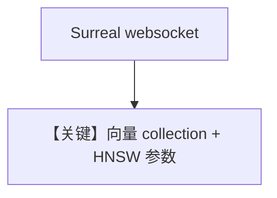

# surreal_db.py — 实现原理分析

<!-- cookbook-py-source:start -->
## 完整源码

```python
"""
SurrealDB Vector DB
===================

Run SurrealDB before running this example:
`docker run --rm --pull always -p 8000:8000 surrealdb/surrealdb:latest start --user root --pass root`
"""

import asyncio

from agno.agent import Agent
from agno.knowledge.embedder.openai import OpenAIEmbedder
from agno.knowledge.knowledge import Knowledge
from agno.vectordb.surrealdb import SurrealDb
from surrealdb import AsyncSurreal, Surreal

# ---------------------------------------------------------------------------
# Setup
# ---------------------------------------------------------------------------
SURREALDB_URL = "ws://localhost:8000"
SURREALDB_USER = "root"
SURREALDB_PASSWORD = "root"
SURREALDB_NAMESPACE = "test"
SURREALDB_DATABASE = "test"


# ---------------------------------------------------------------------------
# Create Knowledge Base
# ---------------------------------------------------------------------------
def create_sync_knowledge() -> Knowledge:
    client = Surreal(url=SURREALDB_URL)
    client.signin({"username": SURREALDB_USER, "password": SURREALDB_PASSWORD})
    client.use(namespace=SURREALDB_NAMESPACE, database=SURREALDB_DATABASE)

    vector_db = SurrealDb(
        client=client,
        collection="recipes",
        efc=150,
        m=12,
        search_ef=40,
        embedder=OpenAIEmbedder(),
    )
    return Knowledge(vector_db=vector_db)


def create_async_knowledge(async_client: AsyncSurreal) -> Knowledge:
    vector_db = SurrealDb(
        async_client=async_client,
        collection="recipes",
        efc=150,
        m=12,
        search_ef=40,
        embedder=OpenAIEmbedder(),
    )
    return Knowledge(vector_db=vector_db)


# ---------------------------------------------------------------------------
# Create Agent
# ---------------------------------------------------------------------------
def create_agent(knowledge: Knowledge) -> Agent:
    return Agent(knowledge=knowledge)


# ---------------------------------------------------------------------------
# Run Agent
# ---------------------------------------------------------------------------
def run_sync() -> None:
    knowledge = create_sync_knowledge()
    agent = create_agent(knowledge)

    knowledge.insert(url="https://agno-public.s3.amazonaws.com/recipes/ThaiRecipes.pdf")
    agent.print_response(
        "What are the 3 categories of Thai SELECT is given to restaurants overseas?",
        markdown=True,
    )


async def run_async() -> None:
    async_client = AsyncSurreal(url=SURREALDB_URL)
    await async_client.signin(
        {"username": SURREALDB_USER, "password": SURREALDB_PASSWORD}
    )
    await async_client.use(namespace=SURREALDB_NAMESPACE, database=SURREALDB_DATABASE)

    knowledge = create_async_knowledge(async_client)
    agent = create_agent(knowledge)

    await knowledge.ainsert(
        url="https://agno-public.s3.amazonaws.com/recipes/ThaiRecipes.pdf"
    )
    await agent.aprint_response(
        "What are the 3 categories of Thai SELECT is given to restaurants overseas?",
        markdown=True,
    )


if __name__ == "__main__":
    run_sync()
    asyncio.run(run_async())
```

<!-- cookbook-py-source:end -->

> 源文件：`cookbook/07_knowledge/09_archive/vector_dbs/surreal_db.py`

## 概述

**`SurrealDb`**：**同步 `Surreal`** 与 **`AsyncSurreal`** 双客户端；**HNSW 参数** `efc`/`m`/`search_ef`；**`OpenAIEmbedder()`**。

**核心配置一览：**

| 配置项 | 值 | 说明 |
|--------|-----|------|
| `SURREALDB_URL` | `ws://localhost:8000` | Docker 见文件头 |

## 核心组件解析

SurrealDB 统一文档/图/向量；`signin` + `use` 选 namespace/database。

## System Prompt 组装

默认 knowledge 段。

## 完整 API 请求

默认 `gpt-4o` + Embeddings。

## Mermaid 流程图



## 关键源码文件索引

| 文件 | 作用 |
|------|------|
| `agno/vectordb/surrealdb/` | |
