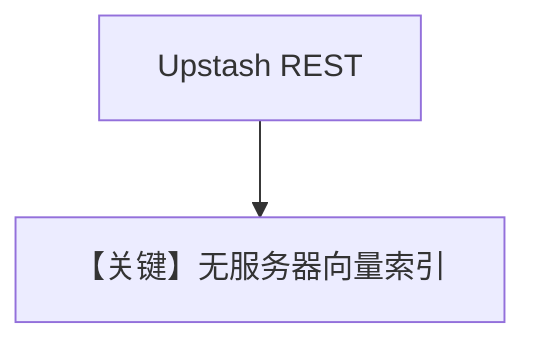

# upstash_db.py — 实现原理分析

> 源文件：`cookbook/07_knowledge/09_archive/vector_dbs/upstash_db.py`

## 概述

**`UpstashVectorDb`**：**REST `UPSTASH_VECTOR_REST_URL`/`TOKEN`**（batch 路径变量名略有别名，以源码为准）；**`OpenAIChat`** + **`OpenAIEmbedder(enable_batch=True)`**。

**核心配置一览：**

| 配置项 | 值 | 说明 |
|--------|-----|------|
| `dimension` | batch 路径 `1536` | 需与嵌入维一致 |

## 核心组件解析

Upstash 为无服务器向量 HTTP API，适合边缘/Serverless 部署。

## System Prompt 组装

默认 knowledge 段。

## 完整 API 请求

OpenAI + Upstash REST。

## Mermaid 流程图

## 关键源码文件索引

| 文件 | 作用 |
|------|------|
| `agno/vectordb/upstashdb/` | |
