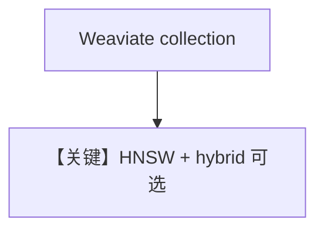

# weaviate_db.py — 实现原理分析

> 源文件：`cookbook/07_knowledge/09_archive/vector_dbs/weaviate_db.py`

## 概述

**`Weaviate`**：**`VectorIndex.HNSW`**，**`Distance.COSINE`**，**`SearchType.vector`/`hybrid`**，**`local=True/False`** 分支；**`WEAVIATE_URL`/`WEAVIATE_API_KEY`**。

**核心配置一览：**

| 配置项 | 值 | 说明 |
|--------|-----|------|
| `wcd_url` | 可选云 Weaviate | |

## 核心组件解析

Weaviate 类 GraphQL API；混合检索需 schema 支持 BM25+vector。

## System Prompt 组装

默认 knowledge 段。

## 完整 API 请求

`OpenAIChat` + Embeddings。

## Mermaid 流程图

## 关键源码文件索引

| 文件 | 作用 |
|------|------|
| `agno/vectordb/weaviate/` | |
