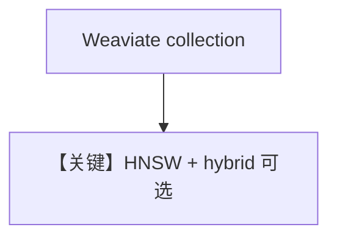

# weaviate_db.py — 实现原理分析

<!-- cookbook-py-source:start -->
## 完整源码

```python
"""
Weaviate Vector DB
==================

Demonstrates Weaviate-backed knowledge with sync, async, and async-batching flows.

Install dependency:
- uv pip install weaviate-client
"""

import asyncio
from os import getenv

from agno.agent import Agent
from agno.knowledge.embedder.openai import OpenAIEmbedder
from agno.knowledge.knowledge import Knowledge
from agno.models.openai import OpenAIChat
from agno.vectordb.search import SearchType
from agno.vectordb.weaviate import Distance, VectorIndex, Weaviate


# ---------------------------------------------------------------------------
# Setup
# ---------------------------------------------------------------------------
def create_sync_knowledge() -> tuple[Knowledge, Weaviate]:
    vector_db = Weaviate(
        collection="vectors",
        search_type=SearchType.vector,
        vector_index=VectorIndex.HNSW,
        distance=Distance.COSINE,
        local=False,
    )
    knowledge = Knowledge(
        name="Basic SDK Knowledge Base",
        description="Agno 2.0 Knowledge Implementation with Weaviate",
        vector_db=vector_db,
    )
    return knowledge, vector_db


def create_async_knowledge(enable_batch: bool = False) -> Knowledge:
    if enable_batch:
        vector_db = Weaviate(
            wcd_url=getenv("WEAVIATE_URL", "http://localhost:8081"),
            wcd_api_key=getenv("WEAVIATE_API_KEY", ""),
            collection="documents",
            embedder=OpenAIEmbedder(enable_batch=True),
        )
    else:
        vector_db = Weaviate(
            collection="recipes_async",
            search_type=SearchType.hybrid,
            vector_index=VectorIndex.HNSW,
            distance=Distance.COSINE,
            local=True,
        )
    return Knowledge(vector_db=vector_db)


# ---------------------------------------------------------------------------
# Create Agent
# ---------------------------------------------------------------------------
def create_sync_agent(knowledge: Knowledge) -> Agent:
    return Agent(knowledge=knowledge)


def create_async_agent(knowledge: Knowledge, enable_batch: bool = False) -> Agent:
    if enable_batch:
        return Agent(
            model=OpenAIChat(id="gpt-5.2"),
            knowledge=knowledge,
            search_knowledge=True,
            read_chat_history=True,
        )
    return Agent(knowledge=knowledge, search_knowledge=True)


# ---------------------------------------------------------------------------
# Run Agent
# ---------------------------------------------------------------------------
def run_sync() -> None:
    knowledge, vector_db = create_sync_knowledge()
    knowledge.insert(
        name="Recipes",
        url="https://agno-public.s3.amazonaws.com/recipes/ThaiRecipes.pdf",
        metadata={"doc_type": "recipe_book"},
        skip_if_exists=True,
    )

    agent = create_sync_agent(knowledge)
    agent.print_response(
        "List down the ingredients to make Massaman Gai", markdown=True
    )

    vector_db.delete_by_name("Recipes")
    vector_db.delete_by_metadata({"doc_type": "recipe_book"})


async def run_async(enable_batch: bool = False) -> None:
    knowledge = create_async_knowledge(enable_batch=enable_batch)
    agent = create_async_agent(knowledge, enable_batch=enable_batch)

    if enable_batch:
        await knowledge.ainsert(path="cookbook/07_knowledge/testing_resources/cv_1.pdf")
        await agent.aprint_response(
            "What can you tell me about the candidate and what are his skills?",
            markdown=True,
        )
    else:
        await knowledge.ainsert(
            name="Recipes",
            url="https://agno-public.s3.amazonaws.com/recipes/ThaiRecipes.pdf",
        )
        await agent.aprint_response("How to make Tom Kha Gai", markdown=True)


if __name__ == "__main__":
    run_sync()
    asyncio.run(run_async(enable_batch=False))
    asyncio.run(run_async(enable_batch=True))
```

<!-- cookbook-py-source:end -->

> 源文件：`cookbook/07_knowledge/09_archive/vector_dbs/weaviate_db.py`

## 概述

**`Weaviate`**：**`VectorIndex.HNSW`**，**`Distance.COSINE`**，**`SearchType.vector`/`hybrid`**，**`local=True/False`** 分支；**`WEAVIATE_URL`/`WEAVIATE_API_KEY`**。

**核心配置一览：**

| 配置项 | 值 | 说明 |
|--------|-----|------|
| `wcd_url` | 可选云 Weaviate | |

## 核心组件解析

Weaviate 类 GraphQL API；混合检索需 schema 支持 BM25+vector。

## System Prompt 组装

默认 knowledge 段。

## 完整 API 请求

`OpenAIChat` + Embeddings。

## Mermaid 流程图



## 关键源码文件索引

| 文件 | 作用 |
|------|------|
| `agno/vectordb/weaviate/` | |
