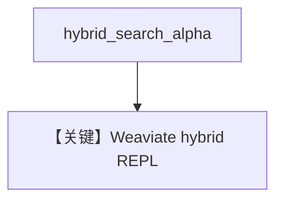

# weaviate_db_hybrid_search.py — 实现原理分析

> 源文件：`cookbook/07_knowledge/09_archive/vector_dbs/weaviate_db_hybrid_search.py`

## 概述

**`Weaviate`** + **`SearchType.hybrid`** + **`hybrid_search_alpha=0.6`**（向量/关键词权重）；**`local=False`**；**`typer` + `rich.prompt`** REPL。

**核心配置一览：**

| 配置项 | 值 | 说明 |
|--------|-----|------|
| `alpha` | `0.6` | 偏向语义或关键词可调 |

## 核心组件解析

`alpha` 控制 hybrid 融合比例（Weaviate 语义）。

## System Prompt 组装

`search_knowledge=True`。

## 完整 API 请求

循环 Chat Completions。

## Mermaid 流程图

## 关键源码文件索引

| 文件 | 作用 |
|------|------|
| `agno/vectordb/weaviate/` | |
