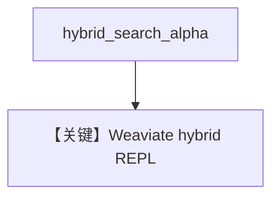

# weaviate_db_hybrid_search.py — 实现原理分析

<!-- cookbook-py-source:start -->
## 完整源码

```python
"""
Weaviate Hybrid Search
======================

Demonstrates Weaviate hybrid retrieval with interactive querying.
"""

import typer
from agno.agent import Agent
from agno.knowledge.knowledge import Knowledge
from agno.vectordb.search import SearchType
from agno.vectordb.weaviate import Distance, VectorIndex, Weaviate
from rich.prompt import Prompt

# ---------------------------------------------------------------------------
# Setup
# ---------------------------------------------------------------------------
vector_db = Weaviate(
    collection="recipes",
    search_type=SearchType.hybrid,
    vector_index=VectorIndex.HNSW,
    distance=Distance.COSINE,
    local=False,
    hybrid_search_alpha=0.6,
)


# ---------------------------------------------------------------------------
# Create Knowledge Base
# ---------------------------------------------------------------------------
knowledge_base = Knowledge(
    name="Weaviate Hybrid Search",
    description="A knowledge base for Weaviate hybrid search",
    vector_db=vector_db,
)


# ---------------------------------------------------------------------------
# Create Agent
# ---------------------------------------------------------------------------
def weaviate_agent(user: str = "user"):
    agent = Agent(
        user_id=user,
        knowledge=knowledge_base,
        search_knowledge=True,
    )

    while True:
        message = Prompt.ask(f"[bold]{user}[/bold]")
        if message in ("exit", "bye"):
            break
        agent.print_response(message)


# ---------------------------------------------------------------------------
# Run Agent
# ---------------------------------------------------------------------------
def main() -> None:
    knowledge_base.insert(
        url="https://agno-public.s3.amazonaws.com/recipes/ThaiRecipes.pdf"
    )
    typer.run(weaviate_agent)


if __name__ == "__main__":
    main()
```

<!-- cookbook-py-source:end -->

> 源文件：`cookbook/07_knowledge/09_archive/vector_dbs/weaviate_db_hybrid_search.py`

## 概述

**`Weaviate`** + **`SearchType.hybrid`** + **`hybrid_search_alpha=0.6`**（向量/关键词权重）；**`local=False`**；**`typer` + `rich.prompt`** REPL。

**核心配置一览：**

| 配置项 | 值 | 说明 |
|--------|-----|------|
| `alpha` | `0.6` | 偏向语义或关键词可调 |

## 核心组件解析

`alpha` 控制 hybrid 融合比例（Weaviate 语义）。

## System Prompt 组装

`search_knowledge=True`。

## 完整 API 请求

循环 Chat Completions。

## Mermaid 流程图



## 关键源码文件索引

| 文件 | 作用 |
|------|------|
| `agno/vectordb/weaviate/` | |
