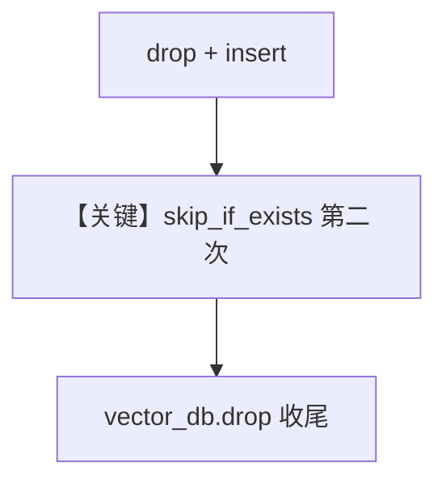

# weaviate_db_upsert.py — 实现原理分析

> 源文件：`cookbook/07_knowledge/09_archive/vector_dbs/weaviate_db_upsert.py`

## 概述

**`SentenceTransformerEmbedder`** 本地嵌入；**`Weaviate` local=True**；**`vector_db.drop()`** 清表；两次 **`insert` 同一 URL**，第二次 **`skip_if_exists=True`**；**无 Agent**。

**核心配置一览：**

| 配置项 | 值 | 说明 |
|--------|-----|------|
| `set_log_level_to_debug` | 调试日志 | |

## 核心组件解析

演示 **幂等插入** 与 **schema 重建** 组合；第二次插入应不重复造数据。

## System Prompt 组装

无 Agent。

## 完整 API 请求

无 LLM；仅有本地 SentenceTransformer 推理。

## Mermaid 流程图

## 关键源码文件索引

| 文件 | 作用 |
|------|------|
| `agno/vectordb/weaviate/` | |
| `agno/knowledge/embedder/sentence_transformer.py` | |
