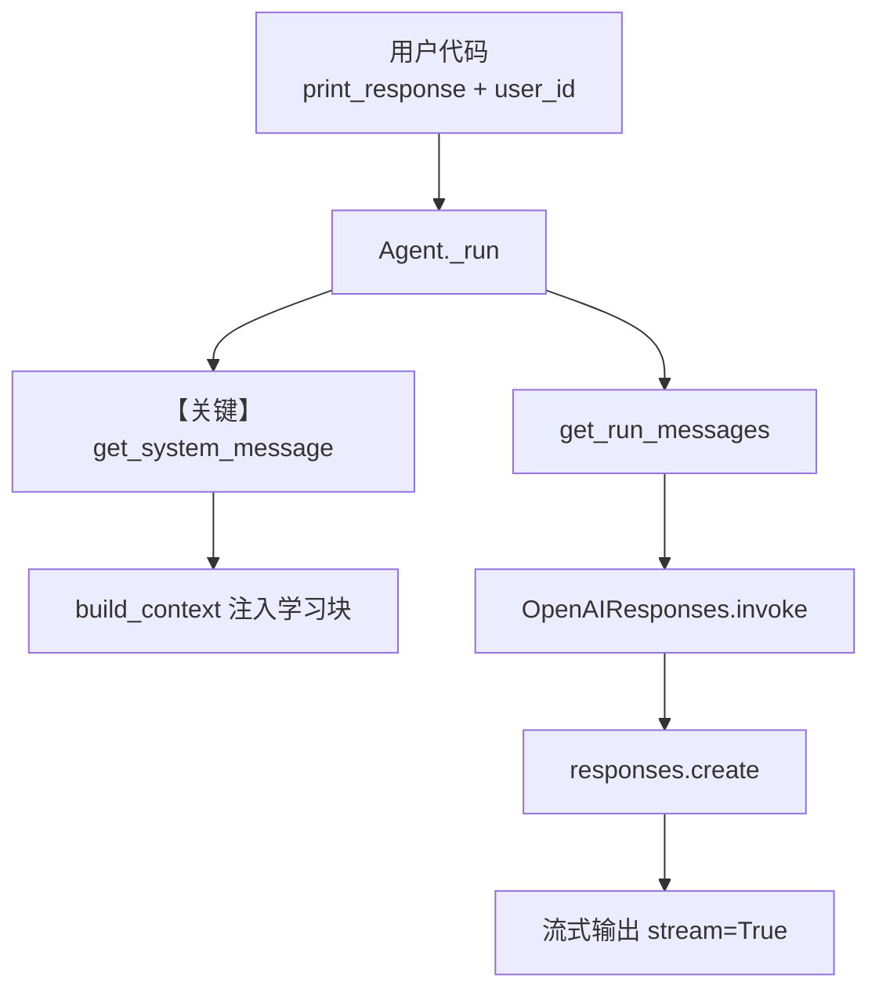

# 01_always_learn.py — 实现原理分析

> 源文件：`cookbook/08_learning/00_quickstart/01_always_learn.py`

## 概述

本示例展示 Agno 的 **`learning=True`（ALWAYS 模式）** 机制：在提供 `db` 的前提下，将 Agent 变为「学习机」，在后台并行抽取用户画像与非结构化记忆，无需模型显式调用工具。

**核心配置一览：**

| 配置项 | 值 | 说明 |
|--------|------|------|
| `model` | `OpenAIResponses(id="gpt-5.2")` | OpenAI Responses API |
| `db` | `SqliteDb(db_file="tmp/agents.db")` | 会话与学习持久化 |
| `learning` | `True` | 启用默认 LearningMachine（等价于用户画像 + 用户记忆的 ALWAYS 抽取） |
| `markdown` | `True` | 在 system 中追加「使用 Markdown 格式化」 |
| `name` | 未设置 | 未设置 |
| `description` | 未设置 | 未设置 |
| `instructions` | 未设置 | 未设置 |
| `add_learnings_to_context` | 默认 `True` | 将 `LearningMachine.build_context()` 结果拼入 system（见 `_messages.py` #3.3.12） |

## 架构分层

```
用户代码层                agno.agent 层
┌──────────────────┐    ┌──────────────────────────────────┐
│ 01_always_learn  │    │ Agent.print_response / _run      │
│ learning=True    │───>│  get_system_message()            │
│ db + user_id     │    │   #3.3.12 _learning.build_context│
│ session_id       │    │  get_run_messages() → 模型调用    │
└──────────────────┘    └──────────────────────────────────┘
                                │
                                ▼
                        ┌──────────────────┐
                        │ OpenAIResponses  │
                        │ gpt-5.2          │
                        │ responses.create │
                        └──────────────────┘
```

## 核心组件解析

### `learning=True` 与 LearningMachine

`learning=True` 在 Agent 初始化后，经 `_init.set_learning_machine` 解析为默认的 `LearningMachine`（用户画像 + 用户记忆等默认配置）。运行结束后可通过 `agent.learning_machine` 访问各 store 并 `print` 调试。

### ALWAYS 抽取（与 AGENTIC 对比）

本文件采用 **ALWAYS**：抽取在响应生成流程中并行完成，对话中**不出现**画像/记忆类工具调用。对比 `02_agentic_learn.py` 中的 `LearningMode.AGENTIC`，后者把更新交给模型通过工具显式触发。

### 运行机制与因果链

1. **数据路径**：用户字符串 → `print_response` → `Agent._run` → `get_run_messages` 组装消息 → `OpenAIResponses.invoke` → `responses.create`；若 `add_learnings_to_context` 为真，`get_system_message` 在 #3.3.12 调用 `agent._learning.build_context(user_id, session_id, ...)`，将召回的画像/会话上下文等拼进 system。
2. **状态与副作用**：写入 `SqliteDb`（会话与学习内容依赖具体 schema）；同用户跨 `session_id` 时，画像与记忆按 `user_id` 关联。重跑脚本会重复写入/更新同一 DB 文件。
3. **关键分支**：`learning=True` vs `LearningMachine(...)` 显式配置；后者可细粒度开关各 store 与模式。
4. **定位**：`00_quickstart` 中最短示例，等价于「打开学习总开关」的入门版。

## System Prompt 组装

| 序号 | 组成部分 | 本文件中的值/来源 | 是否生效 |
|------|---------|-----------------|---------|
| 1 | `description` | 无 | 否 |
| 2 | `role` | 无 | 否 |
| 3 | `instructions` | 无 | 否 |
| 4.1 | `markdown` | 默认附加「Use markdown to format your answers.」 | 是 |
| 4.2 | `add_datetime_to_context` | 默认未开 | 否 |
| 5 | 学习上下文 #3.3.12 | `_learning.build_context(...)` 输出（依赖 DB 中已有数据） | 是（有数据时） |
| 6 | Model 附加 | `model.get_system_message_for_model` | 视模型而定 |

### 拼装顺序与源码锚点

默认路径下（未设置 `agent.system_message`，且 `build_context` 为真）：`# 3.1` 指令列表 → `# 3.2.1` markdown 附加信息 → `# 3.3.1–3.3.4` 描述/角色/指令/附加信息块 → … → `# 3.3.12` 学习上下文 → `# 3.3.14` 模型层 system 片段 → 返回 `Message(role=system_message_role, ...)`。见 `agno/agent/_messages.py` 中 `get_system_message()`。

### 还原后的完整 System 文本

```text
<additional_information>
- Use markdown to format your answers.
</additional_information>
```

（对应 `get_system_message()` 中 `# 3.2.1` 与 `# 3.3.4`：无 `instructions` 时仅追加 markdown 行。其后的 `# 3.3.5` 工具说明、`# 3.3.12` 学习块等随运行时而变，无法仅凭本文件静态写死。）

首次对话前若库中尚无用户数据，`build_context` 可能仅含空占位或极短标签；会话进行后会出现 `<user_profile>`、`<user_memory>` 等运行时内容，**无法仅凭本 `.py` 文件逐字预知**。可在 `LearningMachine.build_context` 返回处或 `get_system_message` 返回前打印 `message.content` 做一次性核对。

### 段落释义（模型视角）

- 「Use markdown…」约束输出为 Markdown，便于 `print_response` 终端渲染。
- 学习段落将已抽取的画像/记忆注入 system，使模型在**不显式调用工具**的情况下仍能利用个性化上下文。

### 与 User 消息的边界

用户轮次内容来自 `print_response` 的第一个参数字符串；system 侧不承担用户任务描述，仅提供格式与记忆上下文。

## 完整 API 请求

```python
# OpenAI Responses API（同步路径与 invoke 一致）
# libs/agno/agno/models/openai/responses.py OpenAIResponses.invoke L671+

client.responses.create(
    model="gpt-5.2",
    input=[...],  # 由 _format_messages 将 system + user 等转为 Responses 的 input 项
    # 另有 get_request_params 合并的 stream、tools 等
)
```

`input` 的具体形状由 `OpenAIResponses._format_messages` 决定；system 侧内容与上一节「还原」一致部分对应，其余为运行时学习块与模型默认 instructions。

## Mermaid 流程图



- **【关键】get_system_message**：本示例的记忆可见性主要由此处是否拼入 `build_context` 决定。

## 关键源码文件索引

| 文件 | 关键函数/类 | 作用 |
|------|------------|------|
| `agno/agent/agent.py` | `learning` / `learning_machine` L257-L719 | 学习配置与懒加载 `_learning` |
| `agno/agent/_messages.py` | `get_system_message()` L106-L450 | #3.3.12 拼接学习上下文 |
| `agno/learn/machine.py` | `LearningMachine.build_context()` L367+ | 召回并格式化注入文本 |
| `agno/models/openai/responses.py` | `invoke()` L671-L695 | Responses API 调用 |
