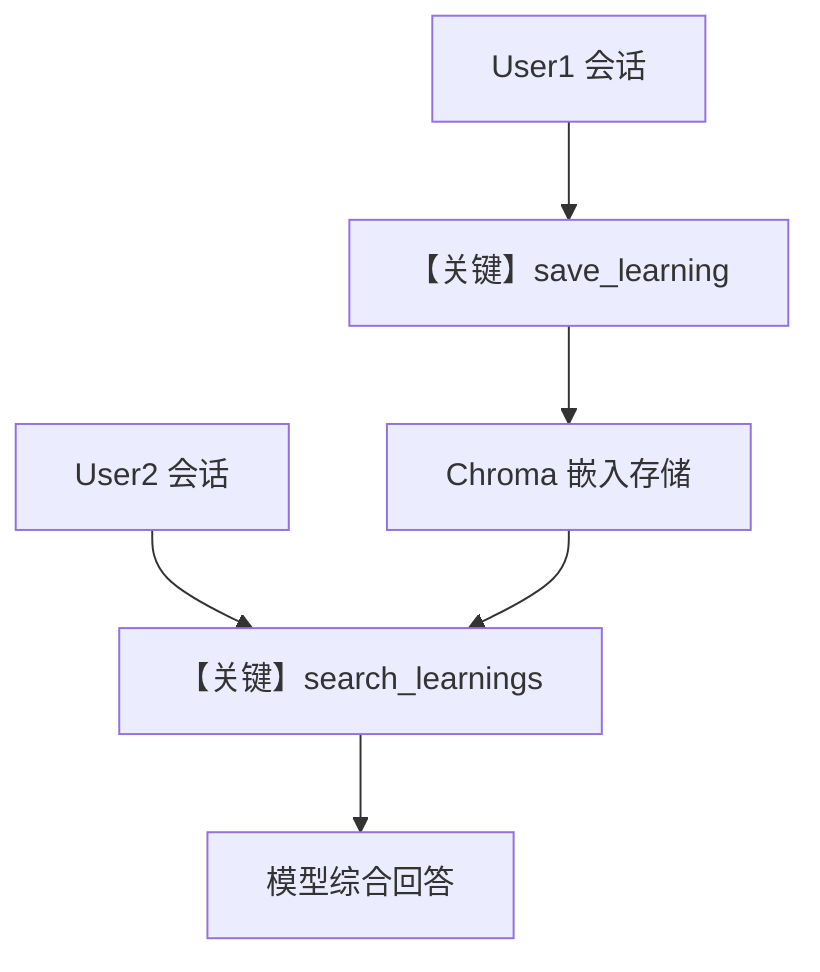

# 03_learned_knowledge.py — 实现原理分析

> 源文件：`cookbook/08_learning/00_quickstart/03_learned_knowledge.py`

## 概述

本示例展示 Agno 的 **跨用户 `LearnedKnowledge` + 向量检索** 机制：用 `Knowledge` + `ChromaDb` 持久化「可复用见解」，并在 `LearningMode.AGENTIC` 下提供 `search_learnings` / `save_learning` 等工具，使用户 A 写入的知识可被用户 B 的会话检索到。

**核心配置一览：**

| 配置项 | 值 | 说明 |
|--------|------|------|
| `model` | `OpenAIResponses(id="gpt-5.2")` | Responses API |
| `db` | `SqliteDb(db_file="tmp/agents.db")` | Agent 会话/元数据 |
| `learning` | `LearningMachine(knowledge=..., learned_knowledge=LearnedKnowledgeConfig(mode=AGENTIC))` | 绑定知识库与学得知识策略 |
| `knowledge` | `Knowledge` + `ChromaDb` + `OpenAIEmbedder` + `SearchType.hybrid` | 向量库与混合检索 |
| `markdown` | `True` | 默认 Markdown 提示 |
| `search_knowledge` | 未显式设置（默认 False） | 与本示例「学得知识」工具不同，需注意与 `search_knowledge=True` 的 RAG 区分 |

## 架构分层

```
用户代码层                agno.agent 层
┌──────────────────┐    ┌──────────────────────────────────┐
│ Knowledge+Chroma │    │ LearningMachine + 学得知识工具   │
│ LearningMachine  │───>│  get_system_message：含 learning │
│                  │    │  块中 CRITICAL RULES 等长文案    │
└──────────────────┘    └──────────────────────────────────┘
                                │
                                ▼
                        ┌──────────────────┐
                        │ OpenAIResponses  │
                        └──────────────────┘
```

## 核心组件解析

### `LearnedKnowledgeConfig(mode=AGENTIC)`

`LearnedKnowledgeStore` 在 AGENTIC 下通过 `build_context` 注入长文 `<learning_system>` 规则（见 `agno/learn/stores/learned_knowledge.py` 中 `_build_agentic_mode_context`），要求模型先 `search_learnings` 再回答/保存。

### `Knowledge` + Chroma

向量数据落在 `tmp/chromadb`，表名逻辑由 `ChromaDb(name="learnings", ...)` 控制；嵌入使用 `text-embedding-3-small`。

### 运行机制与因果链

1. **路径**：用户显式「记住」→ 模型 `save_learning` → 嵌入入库；另一用户提问 → `search_learnings` → 答复融合检索结果。
2. **副作用**：Chroma 持久化目录 + SQLite；重复运行会延续或追加数据。
3. **分支**：若改为 PROPOSE/HITL 等模式，工具与 system 文案会随 `LearnedKnowledgeStore.build_context` 分支变化。
4. **定位**：`00_quickstart` 中演示**跨用户知识沉淀**的最小闭环。

## System Prompt 组装

| 序号 | 组成部分 | 本文件 | 是否生效 |
|------|---------|--------|---------|
| `instructions` | 无 | 否 |
| `markdown` | 是 | 是 |
| AGENTIC 学得知识 | `LearnedKnowledgeStore` 注入大段规则 + 工具说明 | 是 |
| `# 3.3.12` | `build_context` 召回的已有 learning 条目 | 视数据而定 |
| `# 3.3.13` `search_knowledge` | 未启用 agentic RAG 时通常不追加知识库搜索说明 | 否（默认） |

### 还原后的完整 System 文本

本文件未自定义 `instructions`。静态可引用的框架包括：

```text
<additional_information>
- Use markdown to format your answers.
</additional_information>
```

`<learning_system>` 内 **CRITICAL RULES** 与 **Tools** 段落以 `agno/learn/stores/learned_knowledge.py` 中 `_build_agentic_mode_context` 的 `dedent` 字符串为准（行号随版本可能漂移，以源码为准）。运行时若已有向量命中，还会在块内追加已检索到的 learning 摘要。

### 段落释义（模型视角）

- 规则段强制「先搜再答、先搜再存」，减少重复与幻觉式保存。
- 工具段定义 `search_learnings` / `save_learning` 的语义契约。

## 完整 API 请求

```python
client.responses.create(
    model="gpt-5.2",
    input=[...],
    tools=[...],  # search_learnings, save_learning 等
)
```

## Mermaid 流程图



## 关键源码文件索引

| 文件 | 关键函数/类 | 作用 |
|------|------------|------|
| `agno/learn/stores/learned_knowledge.py` | `_build_agentic_mode_context` | System 中长文规则 |
| `agno/learn/machine.py` | `build_context` | 拼接各 store 结果 |
| `agno/agent/_messages.py` | `# 3.3.12` | 将 learning 上下文写入 system |
