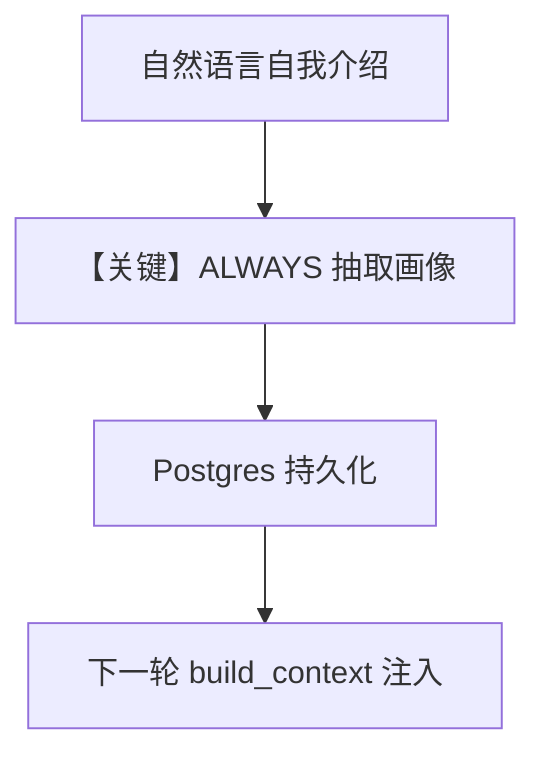

# 1a_user_profile_always.py — 实现原理分析

> 源文件：`cookbook/08_learning/01_basics/1a_user_profile_always.py`

## 概述

本示例展示 **`UserProfileConfig(mode=ALWAYS)`** 与 **PostgreSQL** 持久化：在对话中自然提及姓名与称呼偏好时，由框架在后台抽取结构化用户画像，无需工具调用。

**核心配置一览：**

| 配置项 | 值 | 说明 |
|--------|------|------|
| `model` | `OpenAIResponses(id="gpt-5.2")` | Responses API |
| `db` | `PostgresDb(db_url="postgresql+psycopg://ai:ai@localhost:5532/ai")` | 生产型关系库 |
| `learning` | `LearningMachine(user_profile=UserProfileConfig(mode=ALWAYS))` | 仅开用户画像 ALWAYS |
| `markdown` | `True` | Markdown 提示 |

## 架构分层

```
1a_user_profile_always.py
  learning=LearningMachine(user_profile=ALWAYS)
         │
         ▼
get_system_message → #3.3.12 build_context（含 user_profile 段）
         │
         ▼
OpenAIResponses → responses.create
```

## 核心组件解析

### ALWAYS 用户画像

`UserProfileStore` 在 ALWAYS 下于响应流程中 `extract_and_save`（与 AGENTIC 的显式工具相对）。注入到 system 的 `build_context` 在无数据时可返回空串或占位（见 store 实现）。

### 运行机制与因果链

1. **路径**：同 `user_id`、不同 `session_id` 两轮对话验证跨会话召回。
2. **副作用**：写入 Postgres `ai` 库；需本地 5532 可连。
3. **分支**：对比 `1b_user_profile_agentic.py` 的 AGENTIC。
4. **定位**：`01_basics` 中「结构化画像 + ALWAYS」基线。

## System Prompt 组装

无自定义 `instructions`。静态可还原：

```text
<additional_information>
- Use markdown to format your answers.
</additional_information>
```

其后为 `# 3.3.12` 的 `_learning.build_context` 输出；当已有画像字段时，会包含可读姓名/称呼等（运行时确定）。

### 段落释义（模型视角）

- 画像段让模型称呼用户时与存储一致，而不必重复询问。

## 完整 API 请求

```python
client.responses.create(model="gpt-5.2", input=[...])
```

## Mermaid 流程图



## 关键源码文件索引

| 文件 | 作用 |
|------|------|
| `agno/learn/stores/user_profile.py` | 抽取与 `build_context` |
| `agno/agent/_messages.py` `# 3.3.12` | 拼入 system |
