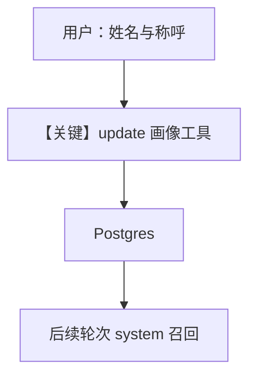

# 1b_user_profile_agentic.py — 实现原理分析

> 源文件：`cookbook/08_learning/01_basics/1b_user_profile_agentic.py`

## 概述

本示例展示 **`UserProfileConfig(mode=AGENTIC)`** 与 **Postgres**：模型通过显式工具维护结构化用户画像，调用可在响应中观察到。

**核心配置一览：**

| 配置项 | 值 | 说明 |
|--------|------|------|
| `model` | `OpenAIResponses(id="gpt-5.2")` | Responses API |
| `db` | `PostgresDb(...)` | 同上 |
| `learning` | `LearningMachine(user_profile=UserProfileConfig(mode=AGENTIC))` | 画像 AGENTIC |
| `markdown` | `True` | 是 |

## 架构分层

与 `1a` 相同入口，差异在 store 模式：工具进入 `Agent` 工具列表，system 含工具说明。

## 核心组件解析

### 与 1a 的差异

| 维度 | 1a ALWAYS | 1b AGENTIC |
|------|-----------|------------|
| 写入可见性 | 无工具调用 | 有工具调用 |
| 适用 | 省心智、自动化 | 可审计、可控 |

### 运行机制与因果链

模型在理解用户自我介绍后调用 profile 更新工具，再生成自然语言回复；第二轮依赖 `build_context` 注入的画像。

## System Prompt 组装

```text
<additional_information>
- Use markdown to format your answers.
</additional_information>
```

外加 AGENTIC 工具文档（`user_profile` store）与 `# 3.3.12` 动态块。

## 完整 API 请求

```python
client.responses.create(model="gpt-5.2", input=[...], tools=[...])
```

## Mermaid 流程图



## 关键源码文件索引

| 文件 | 作用 |
|------|------|
| `agno/learn/stores/user_profile.py` | AGENTIC 工具与 context |
| `agno/agent/_messages.py` | system 与工具指令 |
