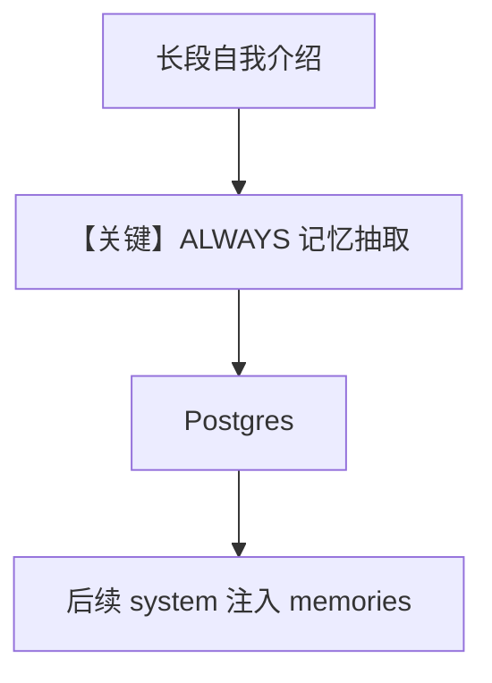

# 2a_user_memory_always.py — 实现原理分析

<!-- cookbook-py-source:start -->
## 完整源码

```python
"""
User Memory: Always Mode
========================
User Memory captures unstructured observations about users:
- Work context and role
- Communication style preferences
- Patterns and interests
- Any memorable facts

ALWAYS mode extracts memories automatically in parallel
while the agent responds - no explicit tool calls needed.

Compare with: 2b_user_memory_agentic.py for explicit tool-based updates.
See also: 1a_user_profile_always.py for structured profile fields.
"""

from agno.agent import Agent
from agno.db.postgres import PostgresDb
from agno.learn import LearningMachine, LearningMode, UserMemoryConfig
from agno.models.openai import OpenAIResponses

# ---------------------------------------------------------------------------
# Create Agent
# ---------------------------------------------------------------------------

db = PostgresDb(db_url="postgresql+psycopg://ai:ai@localhost:5532/ai")

# ALWAYS mode: Extraction happens automatically after each response.
# The agent doesn't see or call any memory tools - it's invisible.
# Memories stores unstructured observations that don't fit profile fields.
agent = Agent(
    model=OpenAIResponses(id="gpt-5.2"),
    db=db,
    learning=LearningMachine(
        user_memory=UserMemoryConfig(
            mode=LearningMode.ALWAYS,
        ),
    ),
    markdown=True,
)

# ---------------------------------------------------------------------------
# Run Demo
# ---------------------------------------------------------------------------

if __name__ == "__main__":
    user_id = "alice@example.com"

    # Session 1: Share information naturally
    print("\n" + "=" * 60)
    print("SESSION 1: Share information (extraction happens automatically)")
    print("=" * 60 + "\n")

    agent.print_response(
        "Hi! I work at Anthropic as a research scientist. "
        "I prefer concise responses without too much explanation. "
        "I'm currently working on a paper about transformer architectures.",
        user_id=user_id,
        session_id="session_1",
        stream=True,
    )
    agent.learning_machine.user_memory_store.print(user_id=user_id)

    # Session 2: New session - memories are recalled automatically
    print("\n" + "=" * 60)
    print("SESSION 2: Memories recalled in new session")
    print("=" * 60 + "\n")

    agent.print_response(
        "What's a good Python library for async HTTP requests?",
        user_id=user_id,
        session_id="session_2",
        stream=True,
    )
    agent.learning_machine.user_memory_store.print(user_id=user_id)
```

<!-- cookbook-py-source:end -->

> 源文件：`cookbook/08_learning/01_basics/2a_user_memory_always.py`

## 概述

本示例展示 **`UserMemoryConfig(mode=ALWAYS)`**：非结构化观察（职业、偏好、项目等）在后台抽取并写入，与结构化 `UserProfile` 互补。

**核心配置一览：**

| 配置项 | 值 | 说明 |
|--------|------|------|
| `model` | `OpenAIResponses(id="gpt-5.2")` | Responses API |
| `db` | `PostgresDb(...)` | Postgres |
| `learning` | `LearningMachine(user_memory=UserMemoryConfig(mode=ALWAYS))` | 仅用户记忆 ALWAYS |
| `markdown` | `True` | 是 |

## 架构分层

`UserMemoryStore` 的 `build_context` 将条列记忆注入 system；ALWAYS 路径在 `process` 中异步抽取。

## 核心组件解析

### 与 User Profile 的分工

画像偏结构化字段；记忆偏长文本观察与偏好细节。同一用户可同时使用两示例中的机制。

### 运行机制与因果链

第二轮「推荐库」类问题可利用第一轮写入的记忆做个性化推荐。

## System Prompt 组装

静态最小块：

```text
<additional_information>
- Use markdown to format your answers.
</additional_information>
```

动态：`<user_memory>` 内为条列记忆或空占位。

## 完整 API 请求

```python
client.responses.create(model="gpt-5.2", input=[...])
```

## Mermaid 流程图



## 关键源码文件索引

| 文件 | 作用 |
|------|------|
| `agno/learn/stores/user_memory.py` | `build_context` / ALWAYS 抽取 |
