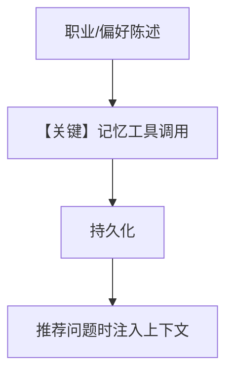

# 2b_user_memory_agentic.py — 实现原理分析

<!-- cookbook-py-source:start -->
## 完整源码

```python
"""
User Memory: Agentic Mode
=========================
User Memory captures unstructured observations about users:
- Work context and role
- Communication style preferences
- Patterns and interests
- Any memorable facts

AGENTIC mode gives the agent explicit tools to save and update memories.
The agent decides when to store information - you can see the tool calls.

Compare with: 2a_user_memory_always.py for automatic extraction.
See also: 1b_user_profile_agentic.py for structured profile fields.
"""

from agno.agent import Agent
from agno.db.postgres import PostgresDb
from agno.learn import LearningMachine, LearningMode, UserMemoryConfig
from agno.models.openai import OpenAIResponses

# ---------------------------------------------------------------------------
# Create Agent
# ---------------------------------------------------------------------------

db = PostgresDb(db_url="postgresql+psycopg://ai:ai@localhost:5532/ai")

# AGENTIC mode: Agent gets memory tools and decides when to use them.
# You'll see tool calls like "update_user_memory" in responses.
agent = Agent(
    model=OpenAIResponses(id="gpt-5.2"),
    db=db,
    learning=LearningMachine(
        user_memory=UserMemoryConfig(
            mode=LearningMode.AGENTIC,
        ),
    ),
    markdown=True,
)

# ---------------------------------------------------------------------------
# Run Demo
# ---------------------------------------------------------------------------

if __name__ == "__main__":
    user_id = "bob@example.com"

    # Session 1: Agent explicitly saves memories
    print("\n" + "=" * 60)
    print("SESSION 1: Share information (watch for tool calls)")
    print("=" * 60 + "\n")

    agent.print_response(
        "I'm a backend engineer at Stripe. "
        "I specialize in distributed systems and prefer Rust over Go.",
        user_id=user_id,
        session_id="session_1",
        stream=True,
    )
    agent.learning_machine.user_memory_store.print(user_id=user_id)

    # Session 2: Agent uses stored memories
    print("\n" + "=" * 60)
    print("SESSION 2: Memories recalled in new session")
    print("=" * 60 + "\n")

    agent.print_response(
        "What programming language would you recommend for my next project?",
        user_id=user_id,
        session_id="session_2",
        stream=True,
    )
    agent.learning_machine.user_memory_store.print(user_id=user_id)
```

<!-- cookbook-py-source:end -->

> 源文件：`cookbook/08_learning/01_basics/2b_user_memory_agentic.py`

## 概述

本示例展示 **`UserMemoryConfig(mode=AGENTIC)`**：模型通过工具写入/更新非结构化记忆，可观察、可调试。

**核心配置一览：**

| 配置项 | 值 | 说明 |
|--------|------|------|
| `learning` | `LearningMachine(user_memory=UserMemoryConfig(mode=AGENTIC))` | 记忆 AGENTIC |
| 其余 | 同 2a：`OpenAIResponses`、`PostgresDb`、`markdown=True` | — |

## 核心组件解析

与 `2a` 对照：AGENTIC 显式工具 vs ALWAYS 隐式抽取。工具名以实际注册为准（如 `update_user_memory` 一类）。

## System Prompt 组装

```text
<additional_information>
- Use markdown to format your answers.
</additional_information>
```

加 `UserMemoryStore` 在 AGENTIC 下附带的工具说明与 `# 3.3.12` 块。

## 完整 API 请求

```python
client.responses.create(model="gpt-5.2", input=[...], tools=[...])
```

## Mermaid 流程图



## 关键源码文件索引

| 文件 | 作用 |
|------|------|
| `agno/learn/stores/user_memory.py` | AGENTIC 工具文档与 context |
