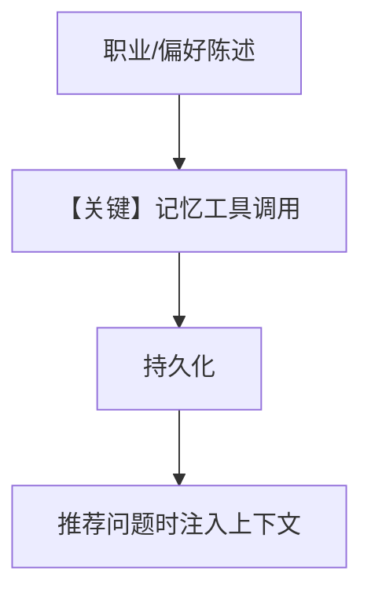

# 2b_user_memory_agentic.py — 实现原理分析

> 源文件：`cookbook/08_learning/01_basics/2b_user_memory_agentic.py`

## 概述

本示例展示 **`UserMemoryConfig(mode=AGENTIC)`**：模型通过工具写入/更新非结构化记忆，可观察、可调试。

**核心配置一览：**

| 配置项 | 值 | 说明 |
|--------|------|------|
| `learning` | `LearningMachine(user_memory=UserMemoryConfig(mode=AGENTIC))` | 记忆 AGENTIC |
| 其余 | 同 2a：`OpenAIResponses`、`PostgresDb`、`markdown=True` | — |

## 核心组件解析

与 `2a` 对照：AGENTIC 显式工具 vs ALWAYS 隐式抽取。工具名以实际注册为准（如 `update_user_memory` 一类）。

## System Prompt 组装

```text
<additional_information>
- Use markdown to format your answers.
</additional_information>
```

加 `UserMemoryStore` 在 AGENTIC 下附带的工具说明与 `# 3.3.12` 块。

## 完整 API 请求

```python
client.responses.create(model="gpt-5.2", input=[...], tools=[...])
```

## Mermaid 流程图



## 关键源码文件索引

| 文件 | 作用 |
|------|------|
| `agno/learn/stores/user_memory.py` | AGENTIC 工具文档与 context |
